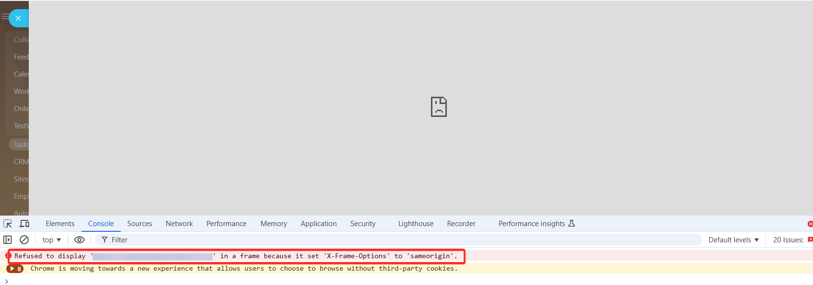
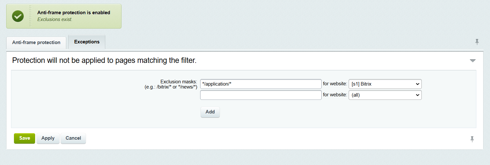

# How to Fix the "Site Cannot Be Reached" Error When Opening an Application



If you are developing integrations for Bitrix24 using AI tools (Codex, Claude Code, Cursor), connect to the [MCP server](../ai-tools/mcp.md) so that the assistant can utilize the official REST documentation.



The server application interface is hosted on an external server. When a user opens an application, Bitrix24 loads the interface page into the embedded `<iframe>` block.

For example, a user launches a local application but sees the message "Site Cannot Be Reached" instead of its interface. This occurs if the application server sends headers that prohibit embedding the page into Bitrix24. The browser cancels the load and displays an error:

```text
The website "address_app_site" does not allow a connection
```

To fix this error, check the application page response headers, determine where they are being added, and allow embedding for your Bitrix24 address.

## Why the Application Does Not Open

Page embedding is regulated by two HTTP headers:

- [`X-Frame-Options`](https://developer.mozilla.org/en-US/docs/Web/HTTP/Reference/Headers/X-Frame-Options) with the value `SAMEORIGIN` allows opening the page in a frame only on a site with the same source
- the [`frame-ancestors`](https://developer.mozilla.org/en-US/docs/Web/HTTP/Reference/Headers/Content-Security-Policy/frame-ancestors) directive of the `Content-Security-Policy` header specifies a list of sources permitted to embed the page

You can see which header blocked the page in the browser console, for example:

```text
Refused to display 'https://address_app_site/' in a frame because it set 'X-Frame-Options' to 'sameorigin'
```





Do not disable embedding protection for the entire site unless necessary. Allow only the exact Bitrix24 address and only for application pages. Server configuration changes must be performed by an administrator.



## How to Check Response Headers

1. Open the application in Bitrix24 and launch the browser developer tools
2. On the *Console* tab, look for a message containing `X-Frame-Options` or `frame-ancestors`
3. On the *Network* tab, reload the page and select the application document request
4. In the *Response Headers* block, check the values of `X-Frame-Options` and `Content-Security-Policy`
5. Determine which component is adding the restrictive header: the application, the web server, a proxy server, or a CDN

Check the actual response headers rather than just the configuration files. For example, the application might add a header via PHP, while a proxy server might duplicate or replace it.

## How to Allow the Application to Open

Specify the exact Bitrix24 source where the application is being opened. For the address `https://your-domain.bitrix24.com`, the CSP policy might look like this:

```http
Content-Security-Policy: frame-ancestors 'self' https://your-domain.bitrix24.com;
```

If the server already sends `Content-Security-Policy`, add the Bitrix24 address to the existing directive `frame-ancestors`. Do not replace the other policy directives.

Do not replace `SAMEORIGIN` with `X-Frame-Options: ALLOW-FROM`: directive `ALLOW-FROM` is deprecated. Remove the limiting `X-Frame-Options` for the application pages at the level where it is added, and configure the allowed sources via `frame-ancestors`.

### Example for Nginx

Before changing the configuration, create a backup of the files. Then find the directives that control embedding:

```bash
grep -iR -E "X-Frame-Options|Content-Security-Policy|frame-ancestors" /etc/nginx
```

If the CSP policy is not yet defined at another level, add it for the application pages:

```nginx
add_header Content-Security-Policy "frame-ancestors 'self' https://your-domain.bitrix24.com" always;
```

If headers are added at multiple levels, change the settings for each of them.

Check the nginx configuration:

```bash
nginx -t
```

A successful check contains the messages `syntax is ok` and `test is successful`. If nginx reports an error, fix it and repeat the check. Do not reload a configuration with errors.

After a successful check, reload the configuration:

```bash
nginx -s reload
```

Open the application again and check the response headers in the *Network* tab. The Bitrix24 address must be present in `frame-ancestors`, and the limiting `X-Frame-Options` must not be added for the application page.

## If the Application Is Hosted on Self-Hosted Bitrix24

When the *Frame Protection* setting is enabled in self-hosted Bitrix24, PHP adds two headers to the response:

```http
X-Frame-Options: SAMEORIGIN
Content-Security-Policy: frame-ancestors 'self';
```

For application pages, it is safer to configure an exception than to disable protection for the entire site:

1. In the administration section, go to *Settings > Proactive Defense > Frame Protection*
2. Go to the *Exceptions* tab
3. Add a URL mask for the application pages, for example `/application/*`, and select the appropriate site
4. Save the settings and check the response headers again



For a URL that matches the exception mask, Bitrix24 does not add `X-Frame-Options` and `Content-Security-Policy` from the frame protection setting. If the headers remain in the response, they are being added by another component. Repeat the response header check.

## What to Check If the Error Persists

| What is seen in the response                                | What to check                                                              |
| ----------------------------------------------------------- | -------------------------------------------------------------------------- |
| `X-Frame-Options: SAMEORIGIN`                               | Which component continues to add the header for the application page       |
| `frame-ancestors 'self'` without the Bitrix24 address       | The existing CSP policy or the exception mask in self-hosted Bitrix24      |
| Multiple `X-Frame-Options` or `Content-Security-Policy`     | The settings of the application, web server, proxy server, and CDN         |
| Headers are fixed, but the browser shows the previous error | The document request response for the application after a full page reload |
