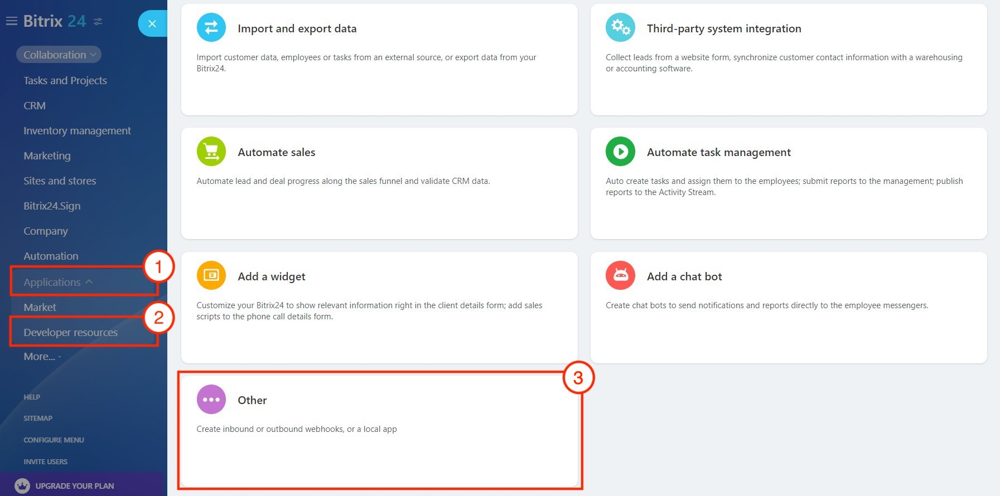
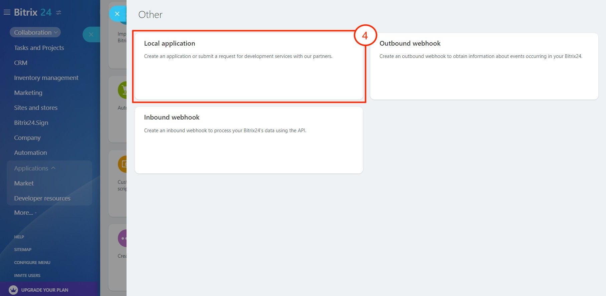
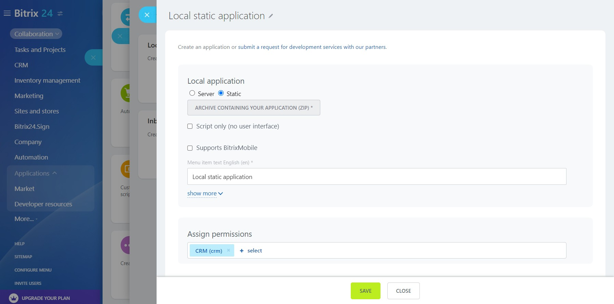
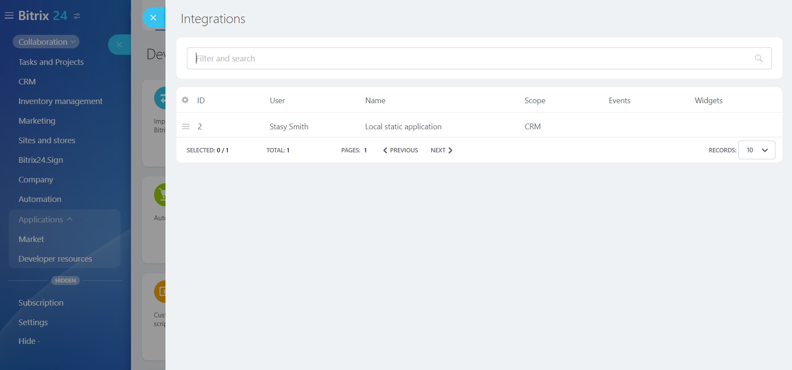

# Static Local Application



Some data may be missing here — we will complete it soon.







- Is a note needed?





> **Attention!** The static local application and its deployment described below are intended for cloud accounts of Bitrix24.
> 
> This type can be used in on-premise accounts if:
> - the application is uploaded to any folder in the file structure of the on-premise account
> - the handler specifies the path to this folder

The archive with the example contains a single file and represents a ready-made application that accesses the REST API and displays the full name of the current user.

[Download archive](https://bitrixsoft.com/docs/marketplace-and-apps24/index.html.zip)

You can install the local application either from the **Developer resources** section (*Applications > Developer resources, tab "Common use cases" > Other > Local application*), or by following this path: Applications (1) — Developer resources (2) — Other (3) — Local application (4):

In the opened form, fill in the basic fields, upload the archive, and specify the necessary permissions (for our example, user management permissions are required):

After saving, the new application will be displayed in the integrations list (*Applications > Developer resources > Integrations*) in your Bitrix24.

 

Find **Full Name** in the left menu or in the **More** menu under Applications and launch it. The launched application will display the full name of the current user by retrieving it via the REST API through the JS library. Since the static local application operates within the Bitrix24 interface, the JS SDK automatically obtains and uses the authorization of the current user who opened the application, and acts solely within the permissions of that user.

## Continue Learning

- [{#T}](serverside-local-app-with-ui.md)
- [{#T}](serverside-local-app-with-no-ui.md)