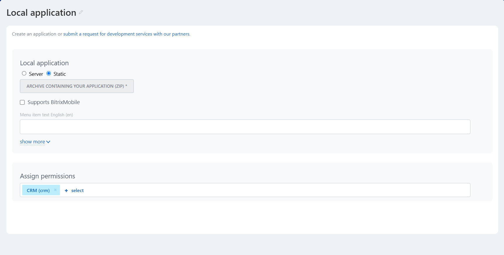

# Static Local Application



If you are developing integrations for Bitrix24 using AI tools (Codex, Claude Code, Cursor), connect to the [MCP server](../ai-tools/mcp.md) so that the assistant can utilize the official REST documentation.



A static local application is an HTML page with JavaScript that Bitrix24 opens in a frame within its interface. This option is suitable when the application needs an interface in Bitrix24 but does not need its own server.

If you need to run code on your own server, store secrets there, or receive Bitrix24 events, choose a [server-side local application with a user interface](./serverside-local-app-with-ui.md).



The method described below for uploading a static local application is intended for Bitrix24 cloud accounts.

For Bitrix24 On-premise, upload the application to a folder in the account's file structure and specify that folder as the handler path.



## Prepare the Archive

Place the `index.html` file in the root of the ZIP archive. This file serves as the application's main page. You can add CSS, JavaScript, images, and other files to the archive and connect them to `index.html` using relative paths.

If setup is required before the first launch, add an `install.html` file to the archive root. Bitrix24 will open it as an [installation wizard](../settings/app-installation/local-apps/installation-master.md).

The following `index.html` example retrieves the current user's name using [user.current](../api-reference/user/user-current.md):

```html
<!doctype html>
<html lang="en">
<head>
    <meta charset="utf-8">
    <title>Current User</title>
    <script src="//api.bitrix24.com/api/v1"></script>
</head>
<body>
    <p id="user-name">Loading...</p>

    <script>
        BX24.init(() => {
            BX24.callMethod('user.current', {}, (result) => {
                const output = document.getElementById('user-name');

                if (result.error())
                {
                    output.textContent = 'Failed to retrieve user data';
                    console.error(result.error());
                    return;
                }

                const user = result.data();
                output.textContent = [user.NAME, user.LAST_NAME]
                    .filter(Boolean)
                    .join(' ');
            });
        });
    </script>
</body>
</html>
```

The example uses [BX24.js](../sdk/bx24-js-sdk/index.md). When the application opens in a frame, the library retrieves authorization data from the Bitrix24 environment and uses it in REST API calls. Therefore, you do not need to store a webhook, `client_secret`, or OAuth tokens in the static application code.

## Create the Application

1. Open *Applications > Developer resources > Other > Local application*. If the *Local application* item is missing, ask the administrator to [configure access to application creation](./local-apps.md#local-app-access)
    

    
2. Select *Static*
    
3. Upload the application ZIP archive in the *Archive containing your application (zip)* field
4. Enable *Supports BitrixMobile* if the application must work in the Bitrix24 mobile app
5. Fill in the *Menu item text English (en)* field
6. In the *Assign permissions* section, select the permissions required for the application's REST API calls
7. Click *Create*

After creation, the application appears in *Applications > Developer resources > Integrations*.


REST API calls are made on behalf of the employee who opened the application. Method availability is limited by the employee's permissions and the permissions selected when creating the application.

## Continue Exploring

- [{#T}](local-apps.md)
- [{#T}](../sdk/bx24-js-sdk/index.md)
- [{#T}](serverside-local-app-with-ui.md)
- [{#T}](serverside-local-app-with-no-ui.md)
