# Recommendations for Developing Reports 

##	1. Link to Only One Report Group.

##	2. Filtering by Date.

Filtering by date is **mandatory** for all reports.
Without it, the risk of overloading the builder increases (the export limit is 10,000 rows), which can lead to the module being blocked.

### 2.1	In Filters:

* Use a filter of the **Time range** type, which lets you select a date range.
* The filter has a **default value**.
* The **maximum range** of the default value is one year.

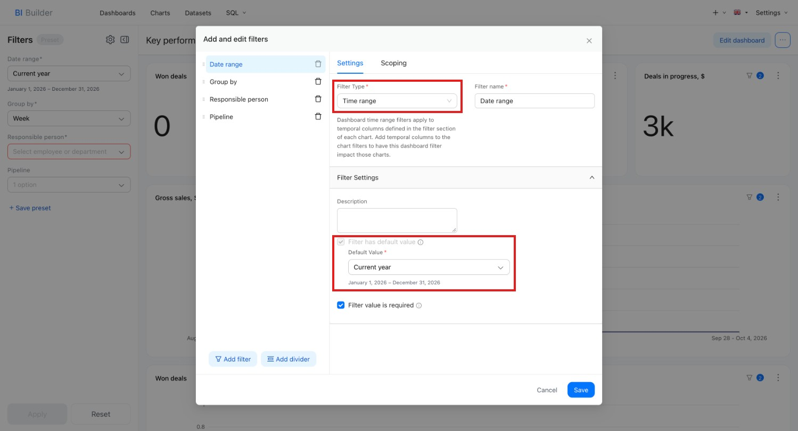

* The date filter must apply **to all charts** in the report.

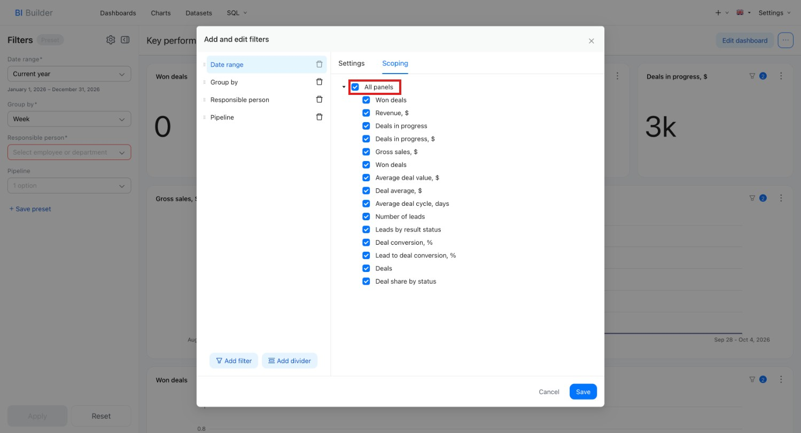

Requirements for other filters: 

* For all filters except **Time grain**, the **Values are dependent on other filters** option must be enabled.
* All filters must **depend on the date filter**.
* The filter name can be anything, not necessarily "Period".
* You can also choose the field used for pre-filtering.

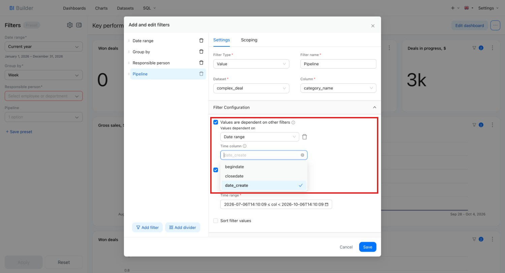

* In each filter (value, numerical range, etc., except "Time range"), set a date restriction in the **Pre-filter available values** option.
* This lets Superset filter possible values in advance and avoid long queries to large datasets. The idea is that if a dataset is very large, pre-filtering the available filter values takes much less time when the data is first filtered by time (or other fields). _Example: for the "Pipeline" filter, the query_ SELECT category_name FROM crm_deal _runs faster with additional filtering by date_.

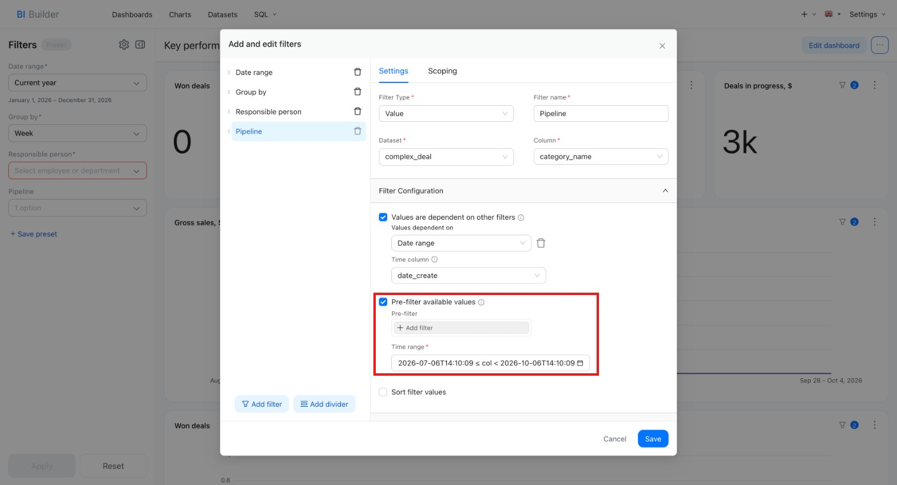

### 2.2 Filtering in the Dataset:

In addition to checking filters at the visualization level, make sure that filtering by date is implemented inside the report dataset itself.

To check which datasets the report uses and open them: 

1. Go to the "Charts" tab.
2. Find the report using the "Dashboard" filter to see the related datasets.
3. Go to the "Datasets" tab and click the pencil icon in the "Actions" column to open the SQL query.

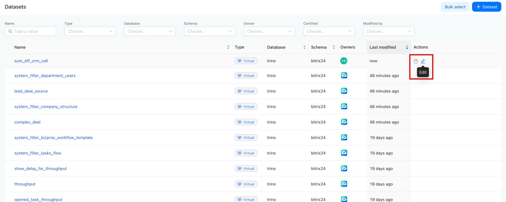

**Important condition:**

The SQL query of the dataset must contain a template that substitutes the time filter values from the report. This approach is called templating (described below). Examples of such constructs: 

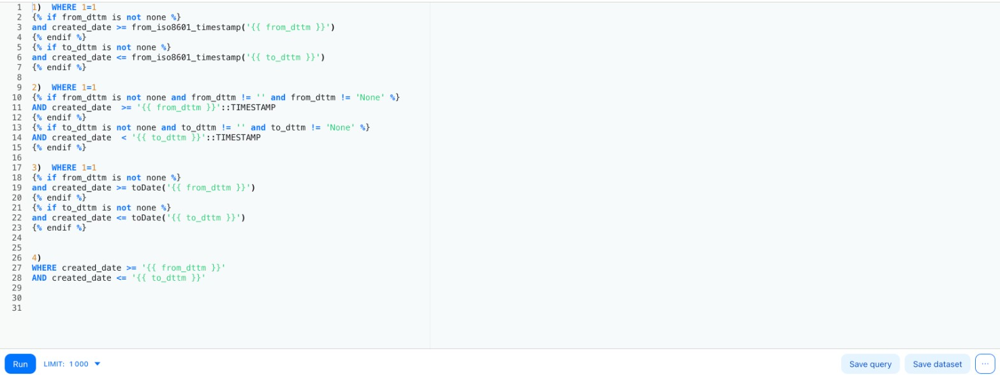

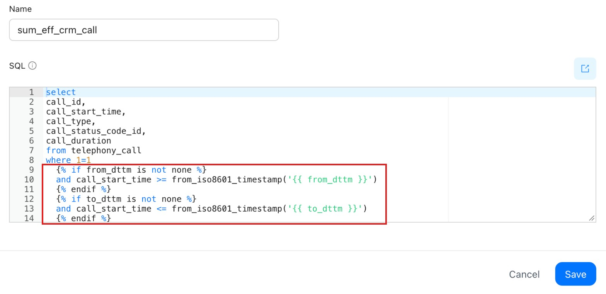

**What templating in Superset is and why you need it.**

In **Apache Superset**, templating lets you create **dynamic SQL queries** that adapt to user filters, date ranges, users, and URL parameters. It is based on the **Jinja** engine built into Superset. A **Jinja template** in Superset is a part of an SQL query wrapped in special syntax ({{ ... }} or ) that is processed before the query is sent to the database.

Superset first substitutes variable values and runs the Python logic inside the template, and only then sends the result to the database as a regular SQL query.

**Templating makes it possible to:**

* apply dynamic filtering by the selected period;
* adjust report behavior for a specific user;
* reuse one dataset for different scenarios;
* optimize SQL queries without hard-coding fixed parameters; 
* adapt chart behavior to URL parameters;
* take dashboard filter values into account.

**Where templating is used**

* SQL Lab – when developing queries manually;
* Virtual Datasets – for dynamic data sources;
* Calculated Columns and Custom Metrics – when creating calculated expressions;
* Custom WHERE/HAVING – for filtering visualizations;
* Advanced filters – when working with complex conditions.

**Main Jinja variables and functions in Superset**

#|
|| **Variable / function** | **Description** ||
|| {{ from_dttm }} | Start date and time (from the time filter) ||
|| {{ to_dttm }} | End date and time ||
|| {{ filter_values('column_name') }} | List of values selected in the filter ||
|| {{ current_username() }} | Name of the current user || 
|| {{ current_user_id() }} | ID of the current user ||
|#

**Usage examples:**

**_Filtering by filter values_**

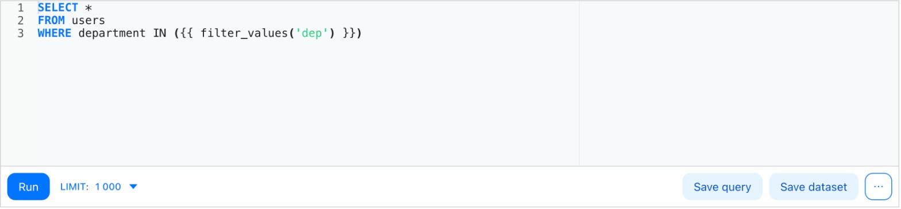

If "HR" and "IT" are selected, the query becomes

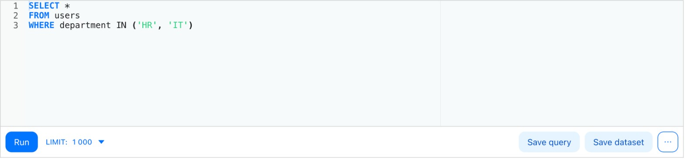

**_Handling an empty filter_**

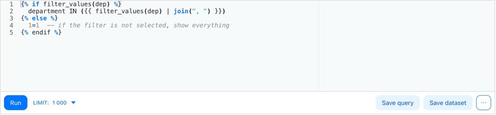

**_Or the short form_**

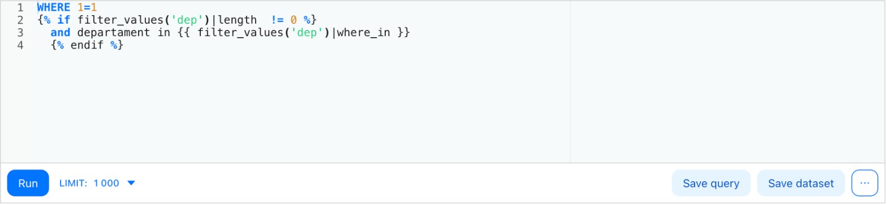

**_Filtering by date_**

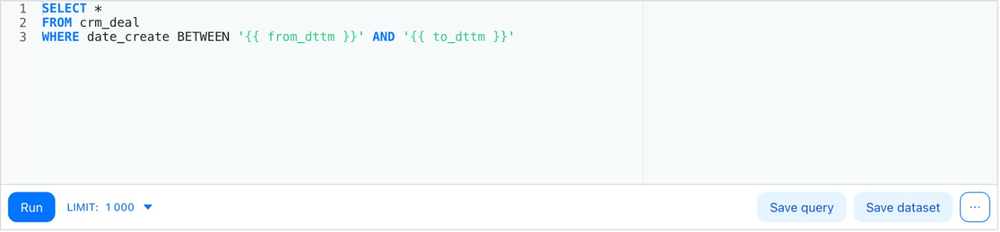

**_Condition on the current user from the URL_**

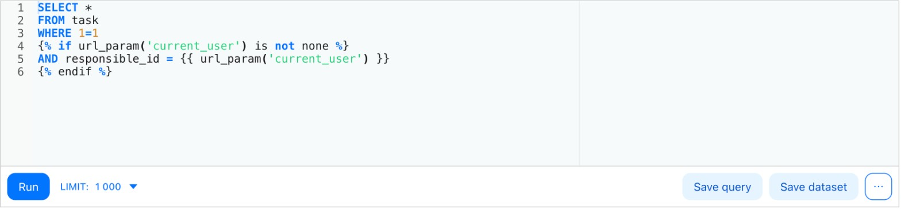

**Important notes:**

* filter_values() always returns a list – even if one item is selected.
* If the filter is not set, filter_values() returns an empty list – handle this with .
* Jinja template code is processed before the query runs – the result is plain SQL.
* The most common use case is filtering by date.

Useful links:

Official Superset [documentation](https://superset.apache.org/user-docs/intro/#documentation)

## 3. Using select * from … in Datasets

Dataset queries **must not** use the SELECT * FROM crm_deal construct. This matters for performance: such queries are excessive, especially with large tables, and can significantly slow down the report or overload the BI Builder.

* Specify explicitly only the fields used in the report visualizations.
* Do not select "all fields" if you do not use all of them.

The figure above shows a good query example: the query requests 5 fields from the table, which are then used in the report. The figure below shows a bad query example: the number of columns has already grown to 27.

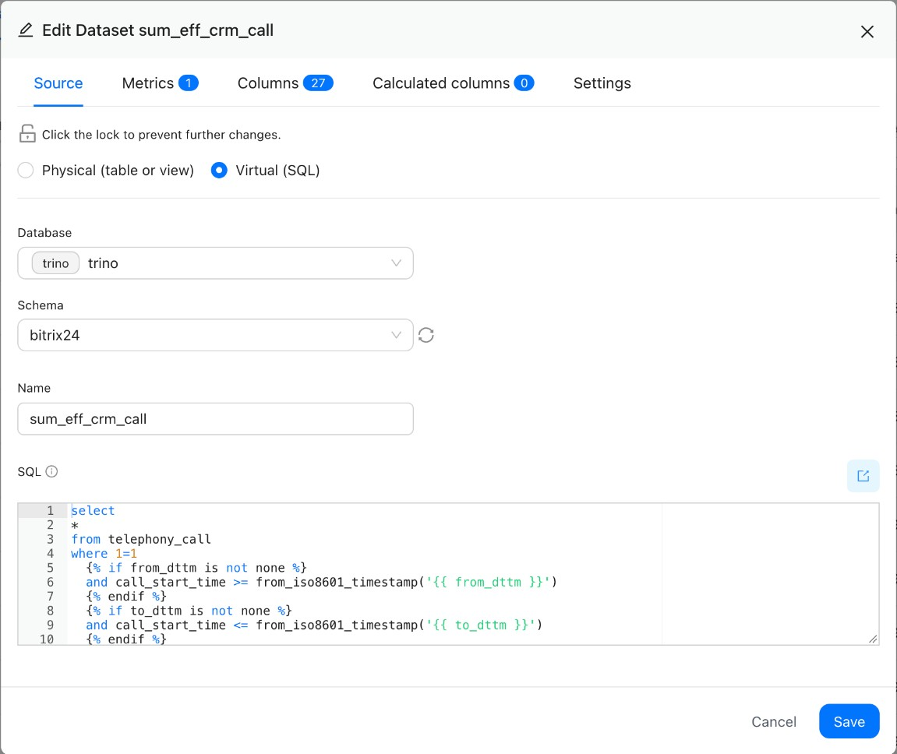

**Large tables (especially sensitive to SELECT *):**

* tasks (task),
* task efficiency (task_efficiency),
* leads (crm_lead),
* deals (crm_deal),
* workflow tasks (bizproc_task),
* running workflows (bizproc_workflow_state),
* activities in CRM items (crm_activity),
* calls (telephony_call),
* time spent (task_elapsed_time),
* status history (crm_lead_status_history),
* products in leads (crm_lead_product_row),
* status history (crm_deal_stage_history),
* products in deals (crm_deal_product_row),
* companies (crm_company),
* contacts (crm_contact),
* links between activities and CRM items (crm_activity_relation),
* links between SPAs and CRM items (crm_entity_relation).

**Small tables (lower overload risk, but the same approach):**

* task flows (flow),
* projects (socialnetwork_group),
* list of SPAs (crm_smart_proc),
* users (user),
* company structure (org_structure),
* task stages (task_stages),
* products (crm_product),
* product properties (crm_product_property),
* product property values (crm_product_property_value),
* CRM item stages (crm_stages),
* digital workplace SPAs (crm_automated_solution_"digital workplace ID").

## 4. Dataset Versioning

Each virtual dataset must have a **version**. This is required so that when a new version of the report is released, the old dataset is correctly replaced with the new one in the client's Bitrix24.

* The version is a number (only **positive integers**: 1, 2, 3, etc.).
* If the SQL structure of the dataset has changed (for example, fields were added or removed, or the query was rebuilt), **increase** the version **by one**.
* If nothing has changed, you can leave the version as is.

**Where to view or change the version:**

1. Open the dataset for editing.
2. Go to the "Settings" tab.
3. Scroll down to the "Extra" field.
4. Make sure it contains the current version, for example {"version": 1}.

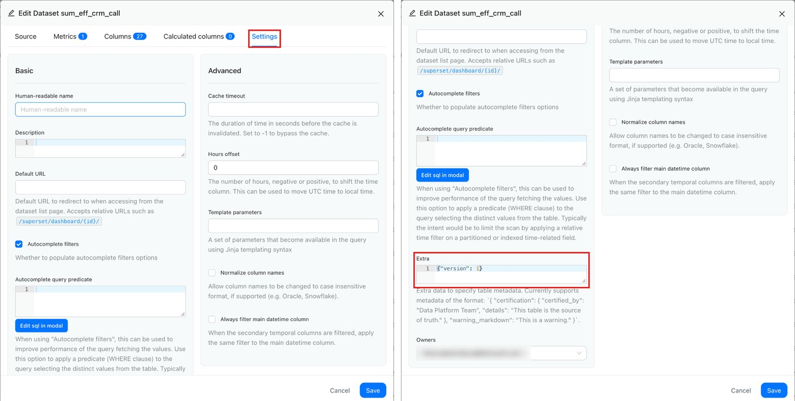

## 5. Working with Heavy Datasets

When working with virtual datasets that contain millions of rows, be especially careful with calculations.

**What is not recommended:**

* Do not use **complex calculations** in the datasets themselves if they are needed in only 1–2 visualizations.
* Avoid **window functions** inside a dataset.

It is better to create a separate dataset or perform the calculation at the chart level.

## 6. Using JOIN in Queries

If a dataset joins several tables (JOIN), make sure that:

1. Each joined table has **filtering by date** (either simple or through templating).
2. There are no JOINs with tables whose **fields are not used** in visualizations (unless this is specifically required).

Example of a correct query with several tables and filtering:

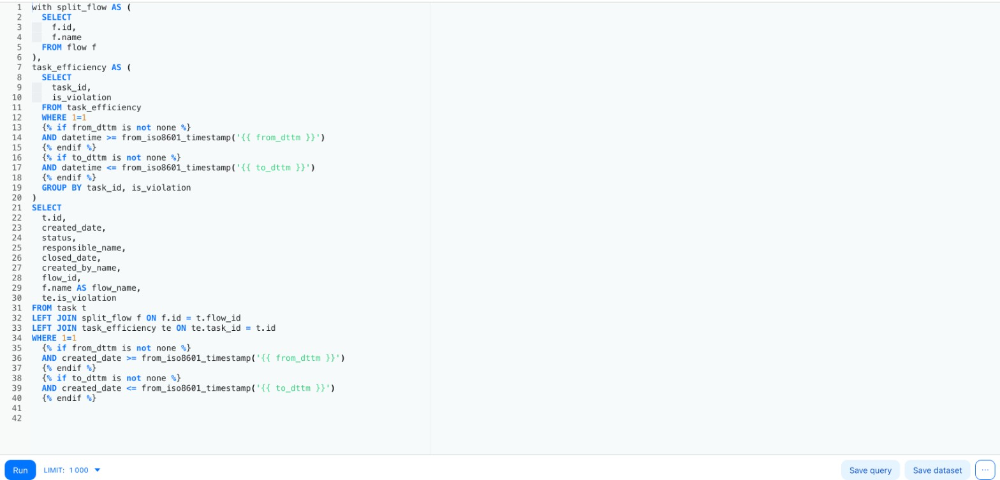

## 7. Checking Dashboard Queries with Built-In Tools:

Superset provides built-in tools for analyzing dashboards and queries. They help you identify:

* which charts work without filtering by date;
* the number of exported rows;
* the memory load;
* which fields each chart uses.

### 7.1 "Usage Statistics" in the Bitrix24 Interface:

1. Go to the BI Builder in the client's Bitrix24.
2. Open the **Analytics hub** tab.
3. Go to the **Usage statistics** section.

In the interface, you can check whether filtering by date is used. If the filter field is empty, the report queries do not filter by date. If the field is filled in, filtering by date is applied. 

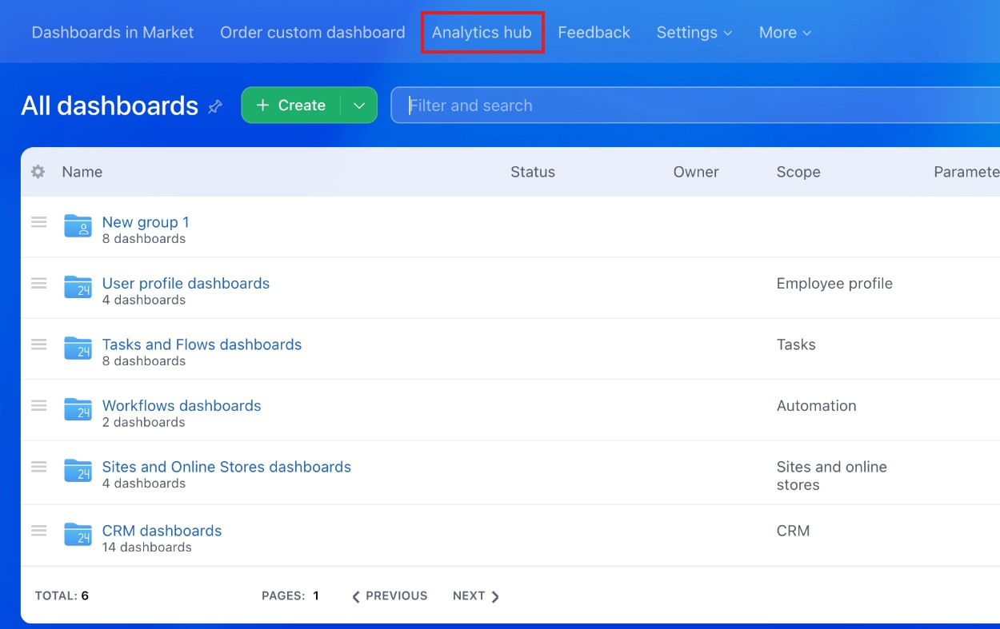

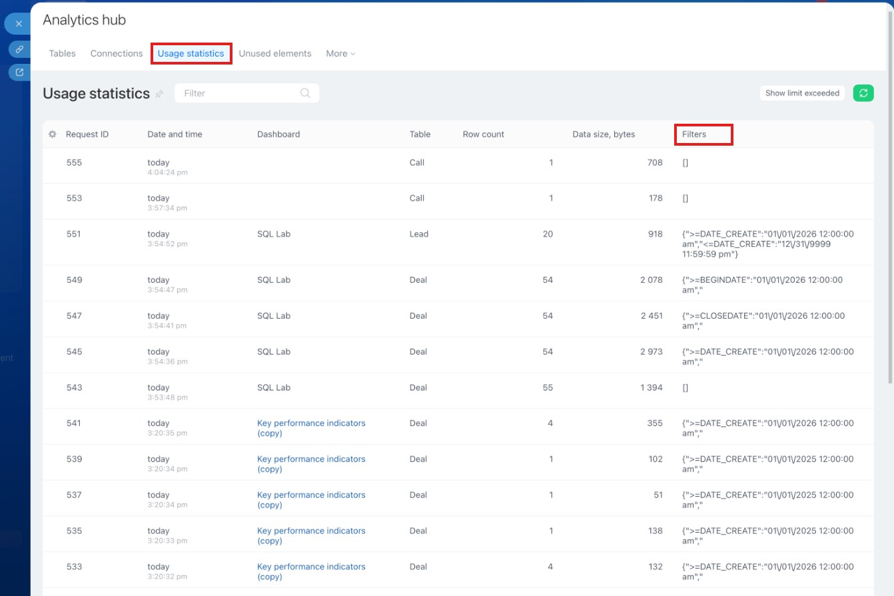

**Tables without a date field:**

1. custom fields (task_uf),
2. task stages (task_stages),
3. task flows (flow),
4. products (crm_product),
5. product properties (crm_product_property),
6. product property values (crm_product_property_value).
7. products in SPAs (crm_dynamic_items_prod_"type ID"),
8. digital workplace SPAs (crm_automated_solution_"digital workplace ID"),
9. list of SPAs (crm_smart_proc),
10. links between SPAs and CRM items (crm_entity_relation),
11. links between activities and CRM items (crm_activity_relation),
12. users (user),
13. company structure (org_structure).

### 7.2	Using a Superset Function

[Documentation](https://helpdesk.bitrix24.com/open/25036288/)

1. Open the dashboard you need in the BI Builder or in the client's Bitrix24.
2. Apply several kinds of filtering by date and other fields.
3. Call the function in SQL Lab: 

```
SELECT 
  TIMESTAMP AS "Request time",
  BI_ENTITY AS "Table",
  SIZE_BYTES AS "Size",
  ROWS AS "Number of rows",
  USED_DATE_FILTER AS "Date filter",
  SERVER_FILTERS_INFO AS "Additional filters"
from TABLE(bitrix24.bi_queries_t())
where 1=1
and TIMESTAMP >= date_add('minute', -5, current_timestamp)
````

4. The function returns the following table:

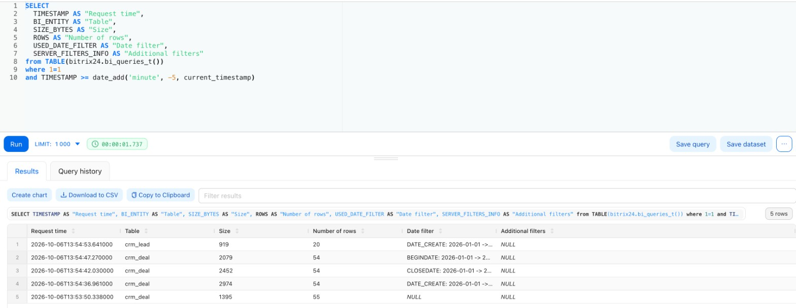

## 8. Using the EXPLAIN Function 

Before the final publication of the report to the client, test the SQL query with the EXPLAIN command ([documentation](https://helpdesk.bitrix24.com/open/25036288/)). 

Why:

* To find out which columns are used for filtering.
* To check whether the query uses **indexes**.
* To assess the risk of a **full table scan** (which can significantly slow down the dashboard).

If a table has more than 100,000 rows and filtering is done by a column without an index, serious performance issues are possible. You can add indexes if needed, but first notify the client and consult technical support if you do not know how to do it.

## 9. Tips from Bitrix24

* Always **test reports on a large amount of data** (close to production).
* Use **BI query statistics** to track the number of rows returned to the client's Bitrix24.
* Monitor the dashboard loading time: the recommended time is **no more than 30 seconds**, even with large data.
* **Limit the amount of data** when needed – with LIMIT or filtering at the SQL level.
* The recommended number of **charts** on a dashboard tab is **no more than 10**.
