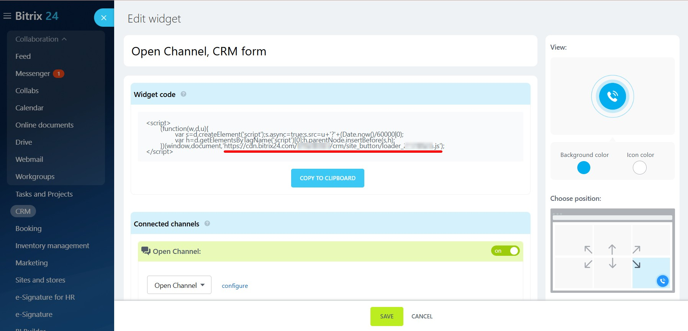

# Show the Bitrix24 CRM widget on your solution pages

People are used to communicating with companies online — using online chat, social networks and messengers. Now Bitrix24 Market solution creators have the opportunity to add their [Bitrix24 CRM widget](https://helpdesk.bitrix24.com/open/17879462/) to their pages for pre-sales consultations and technical support.

To set up the widget, go to Bitrix24, open the window for obtaining the code, copy the URL and paste it into the CRM widget field in your solution details (it may take some time for the solution’s public page cache to refresh).

**Important rules for using the widget**

At the moment, due to security requirements, only Bitrix24 Cloud widgets are supported.

We recommend connecting as many connectors as possible to the widget – not just an online chat, but also social networks and messengers. In addition to being convenient for users, this will also help you since you will be able to source contact details for potential customers.