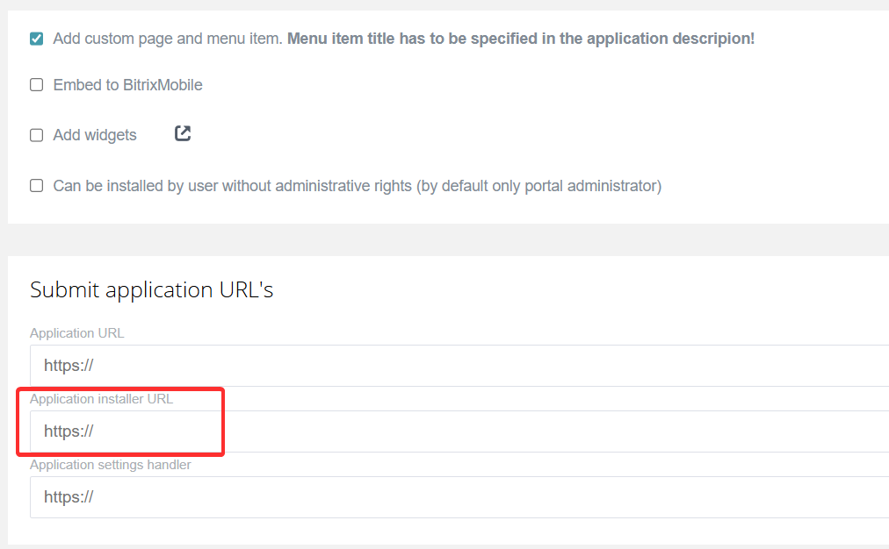

# Completing Application Installation

The main distinction in installing applications in Bitrix24 is the presence or absence of a user interface (UI). This determines whether user confirmation is needed for the installation.

## Application without Interface

An application without an interface operates in the background and does not require user actions.

- For on-premise applications, enable the "Script only (no user interface) " option.

    ")

- For mass-market applications, disable the "Add custom page and menu item. Menu item title has to be specified in the application description!" option.

   

**How it works.** The application installation is processed automatically. A POST request with OAuth 2.0 authorization data: `access_token` and `refresh_token` will be sent to the application URL.

- For on-premise applications — to the URL from the "Initial installation path  " field.

   

- For mass-market applications — to the "Installation event handler URL."

   

**Developer's role.** Process the incoming callback: verify the data, save the tokens, and prepare the application for operation. The application is immediately considered installed in Bitrix24.

## Application with Interface

The operation of an application with an interface depends on the actions performed by the user.

- For on-premise applications, disable the "Script only (no user interface) " option.

    ")

- For mass-market applications, enable the "Add custom page and menu item. Menu item title has to be specified in the application description!" option.

   

**How the installation works.** Upon first opening, the administrator will see the application setup page.

- For on-premise applications — the page from the "Initial installation path" field.

   

- For mass-market applications — the "Application installer URL".

   

At this stage, the application is considered not installed. Automatic installation is not possible, as user actions are required in the setup wizard for the application to function.

**How to complete the installation.** After the user has completed the setup, use the `installFinish` method to finalize the installation. The method is called only from the frontend, from the application setup page.

## What Doesn't Work Until Installation is Complete

Until the application sends a signal indicating the completion of installation via `installFinish`, the application will be considered not configured. Functionality will be blocked.

- Widgets will not appear in the interface, even if [placement.bind](../../api-reference/widgets/placement-bind.md) was successful.

- Events will not be sent to the handler, even after a successful [event.bind](../../api-reference/events/event-bind.md).

- The application interface will not load:
    - regular users will see the message *“The application is not fully installed yet. Please contact your Bitrix24 administrator to complete the installation.”*
    - the administrator will see the page from the "Initial installation path" field for on-premise applications or the "Application installer URL" for mass-market applications.

## How to Check Installation Status

Use the [app.info](../../api-reference/common/system/app-info.md) method to check the installation of the application.



- JS

    ```javascript
    try {
        const response = await $b24.callMethod('app.info', {});
        console.log(response.getData().result.INSTALLED); // true or false
    } catch(error) {
        console.error(error);
    }
    ```

- BX24.js

    ```javascript
    BX24.callMethod(
        "app.info",
        {},
        function(result) {
            if(result.error())
                console.error(result.error());
            else
                console.log(result.data().INSTALLED); // true or false
        }
    );
    ```



If the response is:

- `"INSTALLED": false` — installation is not complete. Call `installFinish`.

- `"INSTALLED": true` — installation was successful.

## How and When to Call installFinish

Call the method on the application setup page:

- for on-premise applications in the file from the "Initial installation path" field,

- for mass-market applications — the "Installation application URL."

Call the method after you have completed the necessary settings: registered widgets, subscribed to events, saved the configuration.



- JS

    [installFinish()](https://bitrix-tools.github.io/b24jssdk/reference/frame-index.html#installFinish)

    ```html
        <script setup lang="ts">
    import { onMounted } from 'vue'
    import { initializeB24Frame } from '@bitrix24/b24jssdk'

    const $b24 = await initializeB24Frame();

    onMounted(async () => {
        try {
            // 1. Register the widget
            await $b24.callMethod('placement.bind', {
                PLACEMENT: 'CRM_DEAL_DETAIL_TAB',
                HANDLER: 'https://example.com/deal-tab',
                TITLE: 'Application Data'
            });

            // 2. Subscribe to the event
            await $b24.callMethod('event.bind', {
                event: 'ONCRMDEALADD',
                handler: 'https://example.com/event-handler'
            });

            // 3. Complete the installation
            await $b24.installFinish();

        } catch (error) {
            console.error('Installation error:', error);
        }
    });
    </script>
    ```

- BX24.js

    [BX24.installFinish()](../../sdk/bx24-js-sdk/system-functions/bx24-install-finish.md)

    ```javascript
        BX24.init(function() {
        // 1. Register the widget in the deal card
        BX24.callMethod('placement.bind', {
            PLACEMENT: 'CRM_DEAL_DETAIL_TAB',
            HANDLER: 'https://example.com/deal-tab',
            TITLE: 'Application Data'
        });

        // 2. Subscribe to the deal creation event
        BX24.callMethod('event.bind', {
            event: 'ONCRMDEALADD',
            handler: 'https://example.com/event-handler'
        });

        // 3. Complete the installation
        BX24.installFinish();
    });
    ```



## Checklist for Verifying Application Installation

1. Application type and necessity of calling `installFinish`.

   - Without an interface, only API — calling `installFinish` is not required. Installation completes automatically.

   - With an interface and setup wizard — calling `installFinish` is mandatory.

2. Verification of calling `installFinish`.

   - The method is called after successfully executing other methods in the installation file.

   - The method is called only once.

3. Verification of functionality after installation.

   - Installation status `INSTALLED: true`.

   - Widgets are displayed in the interface and load the handler interfaces.

   - Events are received by the handler.

   - The application interface opens for employees without administrator rights.