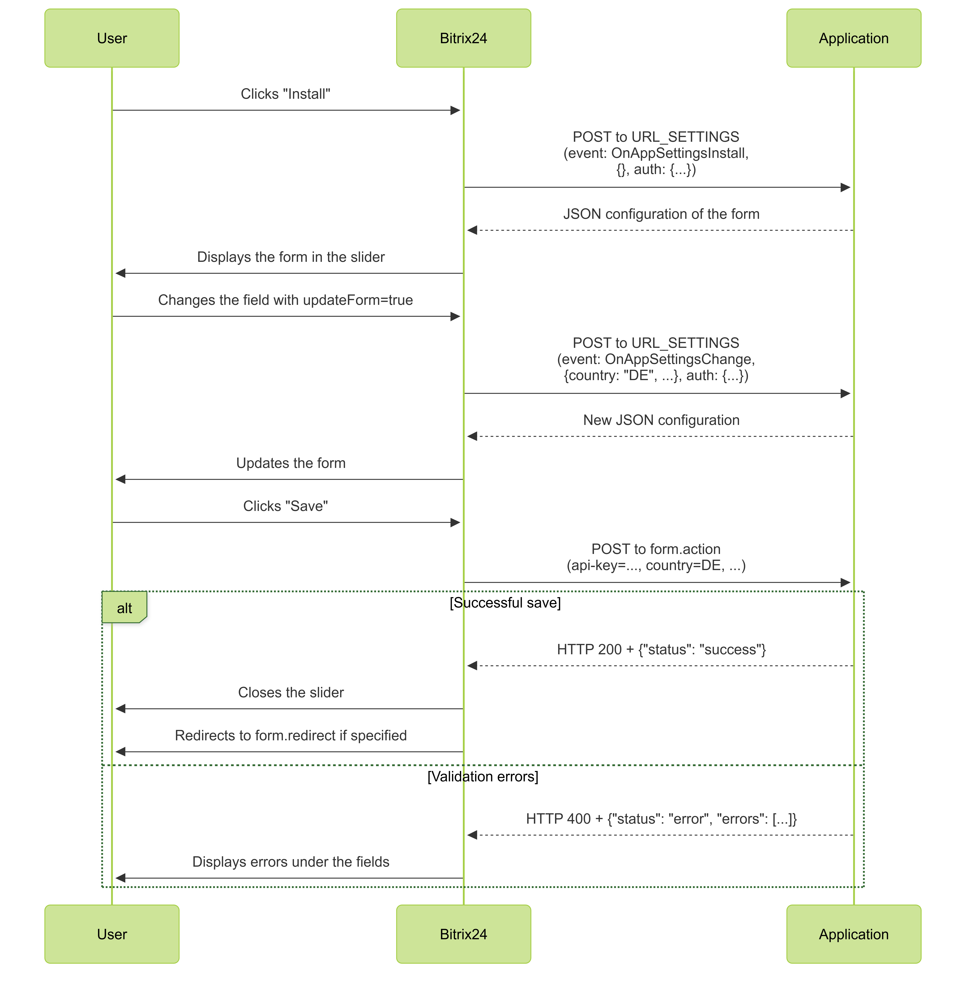

# Setup Wizard for REST-only Applications

The setup wizard for REST-only applications is a built-in form in Bitrix24 for applications without an interface. When developing, you only need to describe the fields in JSON format. The setup wizard will automatically generate a step-by-step form, collect the data, and send it to the specified handler.

Use the setup wizard:

- if the application does not have its own interface,
- for simple settings: text input in a field, selecting an option from a list,
- for an interface in the style of Bitrix24, without a separate UI,
- if the data from the callback handler for the installation event is insufficient.

## How the Wizard Works

Specify the `URL_SETTINGS` parameter when registering the application in the developer's area. If the parameter is filled, after installing the application, the user will see a slider with the setup form.

### Form Lifecycle

1. The user installs the application.
2. Bitrix24 makes a POST request to `URL_SETTINGS`.
3. The application returns the JSON configuration of the form.
4. Bitrix24 displays the form in the slider.
5. When `updateForm: true`, Bitrix24 requests `URL_SETTINGS` again.
6. The user clicks "Save," and the data is sent to `form.action`.
7. The application returns `success` or a list of errors. On `success`, Bitrix24 closes the slider and, if necessary, redirects to `form.redirect`.



## Structure of JSON Configuration

The configuration consists of three blocks:

- header,
- steps with fields,
- save parameters.

### Header

The header sets the title of the settings page and the version of the builder.

```json
{
  "title": "Wizard Title",
  "version": "1"
}
```



#|
|| **Name**
`type` | **Description** ||
|| **title*** 
`string` | Title in the interface ||
|| **version*** 
`string` | Version of the builder, always `"1"` ||
|#

### Steps

`steps` is an array of steps. Each step describes a separate screen of the form.

```json
{
  "id": "step1",
  "title": "API Key",
  "description": "Enter the access key",
  "fields": [
    {
      "id": "api-key",
      "name": "api-key",
      "type": "input",
      "label": "API Key",
      "placeholder": "Enter API Key"
    }
  ]
}
```



#|
|| **Name**
`type` | **Description** ||
|| **id*** 
`string` | Unique identifier of the step ||
|| **title*** 
`string` | Title of the step ||
|| **description** 
`string` | Explanatory text ||
|| **help** 
`boolean` | Flag to display the help icon ||
|| **fields*** 
`array` | Array of fields, [detailed description](#fields) ||
|#

#### Fields Parameter {#fields}



#|
|| **Name**
`type` | **Description** ||
|| **id*** 
`string` | Identifier of the field ||
|| **name*** 
`string` | Name of the field, key in the data ||
|| **type*** 
`string` | Type of the field: 
- `input` — data input field,
- `dropdown-list` — list ||
|| **label** 
`string` | Label above the field ||
|| **placeholder** 
`string` | Hint inside the field ||
|| **value** 
`string` | Default value ||
|| **items** 
`array` | List of options for `dropdown-list` ||
|| **updateForm** 
`boolean` | Flag to update the form when the field changes ||
|#

If the `updateForm` parameter is set to `true`, Bitrix24 will request `URL_SETTINGS` again and pass the current field values in the request. This allows updating the form while the user is filling it out. For example, you can add a new field with a list of regions based on the selected value in the country field.

### Save Parameters

The `form` block describes where to send the data and which buttons to display.

```json
"form": {
  "id": "config-form",
  "action": "https://example.com/save-handler.php",
  "clientId": "local.123...",
  "redirect": "/crm/",
  "saveCaption": "Save",
  "cancelCaption": "Cancel"
}
```



#|
|| **Name**
`type` | **Description** ||
|| **id*** 
`string` | Identifier of the form ||
|| **action*** 
`string` | URL of the save handler ||
|| **clientId*** 
`string` | Identifier of the application client_id ||
|| **redirect** 
`string` | Path after successful saving ||
|| **saveCaption** 
`string` | Label of the "Save" button ||
|| **cancelCaption** 
`string` | Label of the "Cancel" button ||
|#

## Example Configuration

```json
{
  "title": "Storecove e-invoice connector",
  "version": "1",
  "steps": [
    {
      "id": "step1",
      "title": "API Key",
      "description": "Enter the key from your Storecove account",
      "fields": [
        {
          "id": "api-key",
          "name": "api-key",
          "type": "input",
          "label": "Storecove API Key",
          "placeholder": "Enter API Key"
        }
      ]
    },
    {
      "id": "step2",
      "title": "Country",
      "fields": [
        {
          "id": "country",
          "name": "country",
          "type": "dropdown-list",
          "label": "Your Country",
          "items": [
            { "value": "DE", "name": "Germany" },
            { "value": "US", "name": "United States" }
          ],
          "updateForm": true
        }
      ]
    },
    {
      "id": "step3",
      "title": "Company Details",
      "fields": [
        {
          "id": "vat-id",
          "name": "vat-id",
          "type": "input",
          "label": "VAT ID",
          "placeholder": "Enter VAT ID"
        }
      ]
    }
  ],
  "form": {
    "id": "config-form",
    "action": "https://example.com/save.php",
    "clientId": "local.6537665f598492.98090704",
    "redirect": "/",
    "saveCaption": "Connect",
    "cancelCaption": "Later"
  }
}
```

## URL_SETTINGS Handler

Bitrix24 sends a POST request to `URL_SETTINGS` to obtain the form configuration.

```php
[
  'event' => 'OnAppSettingsInstall', // or OnAppSettingsChange / OnAppSettingsDisplay
  'data'  => [ /* current field values */ ],
  'auth'  => [
    'access_token' => '***',
    'expires' => 1768385511,
    'expires_in' => 3600,
    'scope' => 'crm,bizproc,appform,user_brief,placement,catalog',
    'domain' => 'some-domain.bitrix24.com',
    'server_endpoint' => 'https://oauth.bitrix24.tech/rest/',
    'status' => 'F',
    'client_endpoint' => 'https://some-domain.bitrix24.com/rest/',
    'member_id' => '***',
    'refresh_token' => '***',
    'user_id' => 431,
    'client_id' => '***',
    'application_token' => '***'
  ]
]
```

#|
|| **Name**
`type` | **Description** ||
|| **event** 
`string` | Type of event:
- `OnAppSettingsInstall` - when the application is installed,
- `OnAppSettingsChange` - when a field with `updateForm: true` is changed,
- `OnAppSettingsDisplay` - when the application settings are opened ||
|| **data**
`object` | Current values of the form fields ||
|| **auth**
`object` | Authorization data ||
|#

## Post-Save Handler

When the user clicks "Save," Bitrix24 sends the form data to the address specified in the `form.action` field.

```php
$_POST = [
  'data' => [
    'api-key' => 'cc1107f4-...',
    'country' => 'DE',
    // other fields by name (name)
  ],
  'auth' => [
    'access_token' => '***',
    'expires' => 1768385511,
    'expires_in' => 3600,
    'scope' => 'crm,bizproc,appform,user_brief,placement,catalog',
    'domain' => 'some-domain.bitrix24.com',
    'server_endpoint' => 'https://oauth.bitrix24.tech/rest/',
    'status' => 'F',
    'client_endpoint' => 'https://some-domain.bitrix24.com/rest/',
    'member_id' => '***',
    'refresh_token' => '***',
    'user_id' => 431,
    'client_id' => '***',
    'application_token' => '***'
  ],
  'saveform' => 'Y'
];
```

Example of reading data:

```php
$data = $_POST['data'] ?? [];
$apiKey = $data['api-key'] ?? null;
$country = $data['country'] ?? null;
```

### Successful Response

A successful response informs Bitrix24 that the data has been saved. After this, the slider closes. If the `form.redirect` parameter is set, a redirect will occur to the address specified in the parameter.

```php
header("HTTP/1.1 200 OK");
header("Content-Type: application/json");
echo json_encode(['status' => 'success']);
```

### Error Response

If the data is incorrect, return HTTP 400 and a list of errors. The `field` should match the value of `name` in the configuration.

```php
header("HTTP/1.1 400 Bad Request");
header("Content-Type: application/json");
echo json_encode([
  'status' => 'error',
  'errors' => [
    ['field' => 'api-key', 'message' => 'Invalid API key format'],
    ['field' => 'country', 'message' => 'Country is required']
  ]
]);
```

Bitrix24 displays errors under the corresponding fields. You can return multiple errors for a single field.

#### Example Handler for Returning Status

```php
<?php
$data = $_POST['data'] ?? [];

if (($data['api-key'] ?? null) === 'error')
{
    header("HTTP/1.1 400 Bad Request");
    header("Content-Type: application/json");

    echo json_encode([
        'status' => 'error',
        'errors' => [
            [
                'field' => 'api-key',
                'message' => 'You input invalid value',
            ],
            [
                'field' => 'api-key',
                'message' => 'You input invalid value 2',
            ],
        ],
    ]);
    exit();
}

file_put_contents('./settings.json', json_encode($_POST));

header("HTTP/1.1 200 OK");
header("Content-Type: application/json");
echo json_encode(['status' => 'success']);
exit();
?>
```

## Deprecated Method for Displaying the Form

The `appform.show` method is an alternative way to open the form via the push event `showForm`.

Features:

- requires an active user session in Bitrix24, otherwise the event is lost,
- needs `access_token` to call on behalf of the user.

### Example of Calling appform.show via PHP SDK

```php
use Bitrix24\SDK\Core\Credentials\ApplicationProfile;
use Bitrix24\SDK\Services\ServiceBuilderFactory;
use Psr\Log\NullLogger;
use Symfony\Component\EventDispatcher\EventDispatcher;
use Symfony\Component\HttpFoundation\Request;

require_once __DIR__ . '/vendor/autoload.php';

$appProfile = ApplicationProfile::initFromArray([
    'BITRIX24_PHP_SDK_APPLICATION_CLIENT_ID'     => 'local.6537665f598492.98090704',
    'BITRIX24_PHP_SDK_APPLICATION_CLIENT_SECRET' => 'client_secret',
    'BITRIX24_PHP_SDK_APPLICATION_SCOPE'         => 'crm,appform,placement',
]);

// It is assumed that the request came from Bitrix24 (placement)
$serviceBuilder = ServiceBuilderFactory::createServiceBuilderFromPlacementRequest(
    Request::createFromGlobals(),
    $appProfile,
    new EventDispatcher(),
    new NullLogger()
);

$config = [
    'title' => 'Push-initiated Form',
    'version' => '1',
    'steps' => [
        [
            'id' => 'step1',
            'title' => 'API Key',
            'fields' => [
                ['id' => 'key', 'name' => 'key', 'type' => 'input']
            ]
        ]
    ],
    'form' => [
        'id' => 'config-form',
        'action' => 'https://example.com/save.php',
        'clientId' => 'local.6537665f598492.98090704',
        'redirect' => '/'
    ]
];

try {
    $serviceBuilder->core->call('appform.show', [
        'config' => json_encode($config, JSON_THROW_ON_ERROR)
    ]);
} catch (\Throwable $e) {
    // error handling
}
```

The primary method is the automatic request to `URL_SETTINGS` after the application is installed. The `appform.show` method is deprecated.