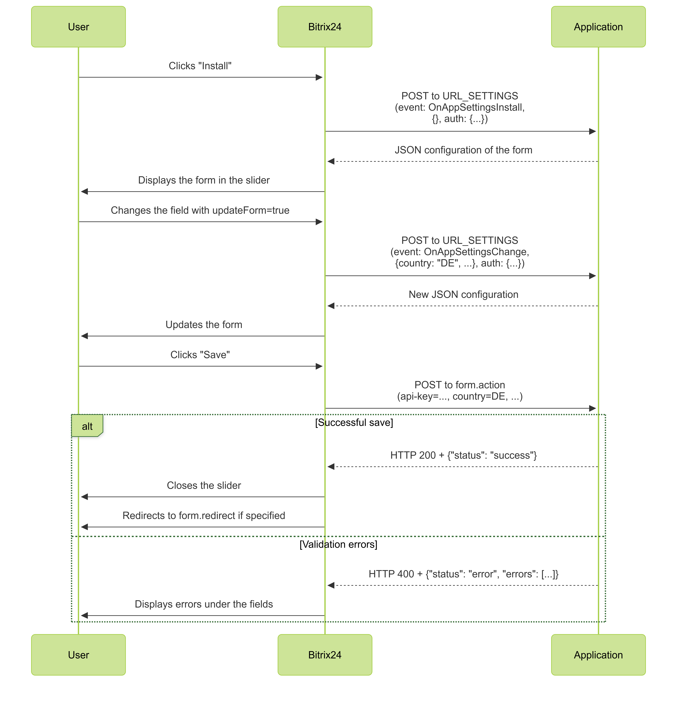

# Configuration wizard for REST-only applications



If you are developing integrations for Bitrix24 using AI tools (Codex, Claude Code, Cursor), connect to the [MCP server](../../../ai-tools/mcp.md) so that the assistant can utilize the official REST documentation.



The REST-only application configuration wizard is a built-in Bitrix24 form for applications without a user interface. During development, it is sufficient to describe the fields in JSON format. The configuration wizard will automatically generate a step-by-step form, collect the data, and send it to the specified handler.

Use the configuration wizard:

- if the application has no interface of its own,
- simple configurations are required: text input in a line, selecting an option from a list,
- a Bitrix24-style interface is needed without a separate UI,
- data from the installation event callback handler is insufficient.

## How the wizard works

Specify the `URL_SETTINGS` parameter in the **Application settings** field when registering an application in the developer console, in the REST-only section. If the parameter is filled, the user will see a slider with a configuration form after installing the application.

If the `URL_SETTINGS` parameter is not filled, the configuration form will not open and Bitrix24 will not send a request to retrieve the form configuration.

### Form lifecycle

1. The user installs the application.
2. Bitrix24 makes a POST request to `URL_SETTINGS` with the `event: OnAppSettingsInstall` parameter.
3. The application returns a JSON form configuration.
4. Bitrix24 displays the form in a slider.
5. Upon `updateForm: true`, Bitrix24 requests `URL_SETTINGS` again with the `event: OnAppSettingsChange` parameter.
6. The user clicks "Save", and the data is sent to `form.action`.
7. The application returns `success` or a list of errors. Upon `success`, Bitrix24 closes the slider and, if necessary, performs a redirect to `form.redirect`.



## JSON configuration structure

The configuration consists of three blocks:

- a header,
- steps with fields,
- saving parameters.

### Header

The header defines the name of the settings page and the builder version.

```json
{
  "title": "Master Name",
  "version": "1"
}
```



#|
|| **Name**
`type` | **Description** ||
|| **title*** 
`string` | Interface heading ||
|| **version*** 
`string` | Builder version, always `"1"` ||
|#

### Steps

`steps` is an array of steps. Each step describes a separate screen of the form.

```json
{
  "id": "step1",
  "title": "API Key",
  "description": "Enter access key",
  "fields": [
    {
      "id": "api-key",
      "name": "api-key",
      "type": "input",
      "label": "API Key",
      "placeholder": "Enter API key"
    }
  ]
}
```



#|
|| **Name**
`type` | **Description** ||
|| **id*** 
`string` | Unique step identifier ||
|| **title*** 
`string` | Step heading ||
|| **description** 
`string` | Explanatory text ||
|| **help** 
`boolean` | Help icon display flag ||
|| **fields*** 
`array` | Array of fields, [detailed description](#fields) ||
|#

#### Parameter fields {#fields}



#|
|| **Name**
`type` | **Description** ||
|| **id*** 
`string` | Field identifier ||
|| **name*** 
`string` | Field name, key in data ||
|| **type*** 
`string` | Field type: 
- `input` — data input string,
- dropdown-list — list ||
|| **label** 
`string` | Label above the field ||
|| **placeholder** 
`string` | Placeholder inside the field ||
|| **value** 
`string` | Default value ||
|| **items** 
`array` | List of options for dropdown-list ||
|| **updateForm** 
`boolean` | Form refresh flag on field change ||
|#

If the `updateForm` parameter is equal to `true`, Bitrix24 will request again `URL_SETTINGS` and pass the current field values in the request.
This allows the form to be updated while the user is filling it out. For example, you can add a new field with a list of regions depending on the value selected in the country field.

### Saving parameters

The `form` block describes where to send the data and which buttons to show.

```json
"form": {
  "id": "config-form",
  "action": "https://example.com/save-handler.php",
  "clientId": "local.123...",
  "redirect": "/crm/",
  "saveCaption": "Save",
  "cancelCaption": "Cancel"
}
```



#|
|| **Name**
`type` | **Description** ||
|| **id*** 
`string` | Form identifier ||
|| **action*** 
`string` | Save handler URL ||
|| **clientId*** 
`string` | Application identifier client_id ||
|| **redirect** 
`string` | Path after successful save ||
|| **saveCaption** 
`string` | "Save" button label ||
|| **cancelCaption** 
`string` | "Cancel" button label ||
|#

## Configuration example

```json
{
  "title": "Storecove e-invoice connector",
  "version": "1",
  "steps": [
    {
      "id": "step1",
      "title": "API Key",
      "description": "Specify the key from your Storecove account",
      "fields": [
        {
          "id": "api-key",
          "name": "api-key",
          "type": "input",
          "label": "Storecove API Key",
          "placeholder": "Enter API key"
        }
      ]
    },
    {
      "id": "step2",
      "title": "Country",
      "fields": [
        {
          "id": "country",
          "name": "country",
          "type": "dropdown-list",
          "label": "Your country",
          "items": [
            { "value": "RU", "name": "United States" },
            { "value": "DE", "name": "Germany" },
            { "value": "US", "name": "United States" }
          ],
          "updateForm": true
        }
      ]
    },
    {
      "id": "step3",
      "title": "Company details",
      "fields": [
        {
          "id": "vat-id",
          "name": "vat-id",
          "type": "input",
          "label": "VAT ID",
          "placeholder": "Enter VAT ID"
        }
      ]
    }
  ],
  "form": {
    "id": "config-form",
    "action": "https://example.com/save.php",
    "clientId": "local.6537665f598492.98090704",
    "redirect": "/",
    "saveCaption": "Connect",
    "cancelCaption": "Later"
  }
}
```

## URL_SETTINGS handler

Bitrix24 sends a POST request to `URL_SETTINGS` to retrieve the form configurations. The values `OnAppSettingsInstall`, `OnAppSettingsDisplay`, and `OnAppSettingsChange` are not separate events. These are values of the `event` parameter, which the application uses to determine the request scenario.

In response to the request, the application must return a JSON form configuration. If the response is correct, Bitrix24 will display the form in the interface.

### Call scenarios

In the examples, the `auth` object is abbreviated.

`OnAppSettingsInstall` is passed after the application is installed.

```json
{
  "event": "OnAppSettingsInstall",
  "auth": {}
}
```

`OnAppSettingsDisplay` is passed when a user manually opens the application settings from the application card.

```json
{
  "event": "OnAppSettingsDisplay",
  "auth": {}
}
```

`OnAppSettingsChange` is passed when a user changes the value of a field with the `updateForm: true` parameter. An object is additionally passed in the request `data` with the current field values.

```json
{
  "event": "OnAppSettingsChange",
  "data": {
    "api-key": "cc1107f4-...",
    "country": "DE"
  },
  "auth": {}
}
```

Example of a POST request in PHP:

```php
[
  'event' => 'OnAppSettingsInstall', // or OnAppSettingsChange / OnAppSettingsDisplay
  'data'  => [ /* current field values */ ],
  'auth'  => [
    'access_token' => '***',
    'expires' => 1768385511,
    'expires_in' => 3600,
    'scope' => 'crm,bizproc,appform,user_brief,placement,catalog',
    'domain' => 'some-domain.bitrix24.ru',
    'server_endpoint' => 'https://oauth.bitrix.info/rest/',
    'status' => 'F',
    'client_endpoint' => 'https://some-domain.bitrix24.com/rest/',
    'member_id' => '***',
    'refresh_token' => '***',
    'user_id' => 431,
    'client_id' => '***',
    'application_token' => '***'
  ]
]
```

#|
|| **Name**
`type` | **Description** ||
|| **event** 
`string` | Request scenario:
- `OnAppSettingsInstall` — after application installation
- `OnAppSettingsDisplay` — when opening application settings
- `OnAppSettingsChange` — when changing a field with `updateForm: true` ||
|| **data**
`object` | Current form field values. Passed for `OnAppSettingsChange` ||
|| **auth**
`object` | Authorization data ||
|#

## Post-save handler

When a user clicks "Save", Bitrix24 sends the form data to the address specified in the `form.action` field.

```php
$_POST = [
  'data' => [
    'api-key' => 'cc1107f4-...',
    'country' => 'DE',
    // other fields by name (name)
  ],
  'auth' => [
    'access_token' => '***',
    'expires' => 1768385511,
    'expires_in' => 3600,
    'scope' => 'crm,bizproc,appform,user_brief,placement,catalog',
    'domain' => 'some-domain.bitrix24.ru',
    'server_endpoint' => 'https://oauth.bitrix.info/rest/',
    'status' => 'F',
    'client_endpoint' => 'https://some-domain.bitrix24.com/rest/',
    'member_id' => '***',
    'refresh_token' => '***',
    'user_id' => 431,
    'client_id' => '***',
    'application_token' => '***'
  ],
  'saveform' => 'Y'
];
```

Example of reading data:

```php
$data = $_POST['data'] ?? [];
$apiKey = $data['api-key'] ?? null;
$country = $data['country'] ?? null;
```

### Successful response

A successful response informs Bitrix24 that the data has been retained. After this, the slider closes. If the `form.redirect` parameter is set, a redirect to the address in the parameter will be performed.

```php
header("HTTP/1.1 200 OK");
header("Content-Type: application/json");
echo json_encode(['status' => 'success']);
```

### Error response

If the data is incorrect, return HTTP 400 and a list of errors. The `field` field must match the `name` value in the configuration.

```php
header("HTTP/1.1 400 Bad Request");
header("Content-Type: application/json");
echo json_encode([
  'status' => 'error',
  'errors' => [
    ['field' => 'api-key', 'message' => 'Invalid API key format'],
    ['field' => 'country', 'message' => 'Country is required']
  ]
]);
```

Bitrix24 displays errors under the corresponding fields. You can return multiple errors for a single field.

#### Example handler for returning a status

```php
<?php
$data = $_POST['data'] ?? [];

if (($data['api-key'] ?? null) === 'error')
{
    header("HTTP/1.1 400 Bad Request");
    header("Content-Type: application/json");

    echo json_encode([
        'status' => 'error',
        'errors' => [
            [
                'field' => 'api-key',
                'message' => 'You input invalid value',
            ],
            [
                'field' => 'api-key',
                'message' => 'You input invalid value 2',
            ],
        ],
    ]);
    exit();
}

file_put_contents('./settings.json', json_encode($_POST));

header("HTTP/1.1 200 OK");
header("Content-Type: application/json");
echo json_encode(['status' => 'success']);
exit();
?>
```

## Deprecated form display method

The `appform.show` method is an alternative way to open the form via the `showForm` push event.

Features:

- an active user session in Bitrix24 is required, otherwise the event is lost,
- `access_token` is required to call on behalf of the user.

### Example of calling appform.show via PHP SDK

```php
use Bitrix24\SDK\Core\Credentials\ApplicationProfile;
use Bitrix24\SDK\Services\ServiceBuilderFactory;
use Psr\Log\NullLogger;
use Symfony\Component\EventDispatcher\EventDispatcher;
use Symfony\Component\HttpFoundation\Request;

require_once __DIR__ . '/vendor/autoload.php';

$appProfile = ApplicationProfile::initFromArray([
    'BITRIX24_PHP_SDK_APPLICATION_CLIENT_ID'     => 'local.6537665f598492.98090704',
    'BITRIX24_PHP_SDK_APPLICATION_CLIENT_SECRET' => 'client_secret',
    'BITRIX24_PHP_SDK_APPLICATION_SCOPE'         => 'crm,appform,placement',
]);

// It is assumed that the request came from Bitrix24 (placement)
$serviceBuilder = ServiceBuilderFactory::createServiceBuilderFromPlacementRequest(
    Request::createFromGlobals(),
    $appProfile,
    new EventDispatcher(),
    new NullLogger()
);

$config = [
    'title' => 'Push-initiated form',
    'version' => '1',
    'steps' => [
        [
            'id' => 'step1',
            'title' => 'API Key',
            'fields' => [
                ['id' => 'key', 'name' => 'key', 'type' => 'input']
            ]
        ]
    ],
    'form' => [
        'id' => 'config-form',
        'action' => 'https://example.com/save.php',
        'clientId' => 'local.6537665f598492.98090704',
        'redirect' => '/'
    ]
];

try {
    $serviceBuilder->core->call('appform.show', [
        'config' => json_encode($config, JSON_THROW_ON_ERROR)
    ]);
} catch (\Throwable $e) {
    // error handling
}
```

The primary method is an automatic request to `URL_SETTINGS` after the application is installed. The `appform.show` method is deprecated.