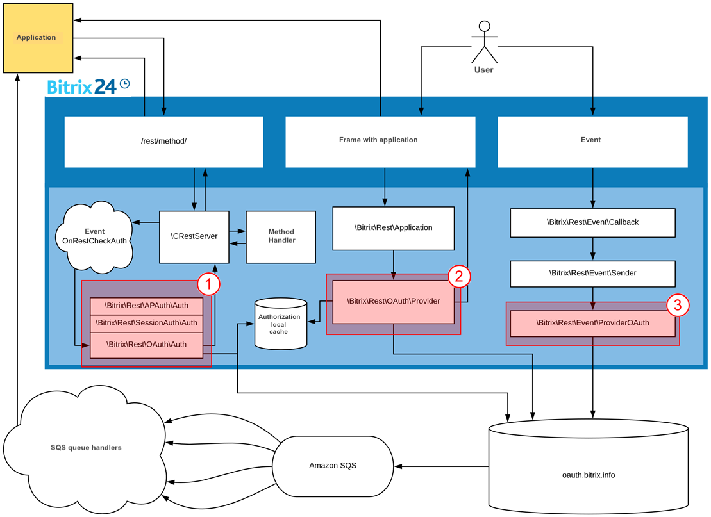
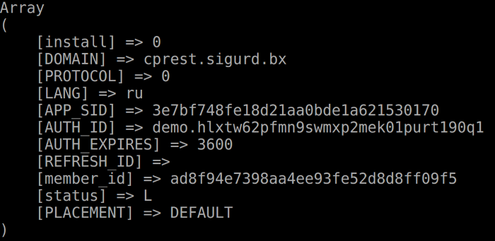

# Application Authorization in Isolated Bitrix24 Box

Company security policies can impose various restrictions on internal and external network resources, which may prevent REST applications for Bitrix24 from accessing the on-premise Bitrix24 or external cloud services. However, there is a solution that allows you to develop applications using the standard REST API for Bitrix24 even in such cases.



The solution described below (exclusion from the authorization process of the server oauth.bitrix.info) is recommended for use only as a last resort, as you will need to handle the secure use of applications and authorization management yourself.



## Accessing External Resources

In the operation of REST applications, there are three moments when the portal makes external calls:

1. Authorization validator
2. Authorization provider
3. Event provider



Let's consider methods that will allow us to avoid calls to external resources.



The example considers a situation where it is necessary to allow only a specific application to bypass the main chain.



## Authorization Validator

Let's create our own event handler.

```php
<?php
namespace Demo\AuthProvider;

class AuthSimple
{
    const AUTH_TYPE = 'demo_simple';

    const AUTH_PARAM_NAME = 'secret_word';
    const AUTH_PARAM_VALUE = 'MySuperSecurePassword123456';

    public static function onRestCheckAuth(array $query, $scope, &$res)
    {
        if(array_key_exists(static::AUTH_PARAM_NAME, $query))
        {
            $res = array(
                'error' => 'INVALID_CREDENTIALS',
                'error_description' => 'Invalid request credentials'
            );

            return false;
        }

        return null;
    }
}
```

The validator receives all the complete request data from the application. If the request does not contain the `secret_word` parameter, it responds with `return null`, meaning "not my request." If this parameter is present in the request, the handler checks the request against the value. If the value exists but does not match the stored one, it responds: "yes, the request is mine, but the value is incorrect." If the value is correct, it returns the user's `ID`, a list of available scopes, indicates which parameters need to be removed before passing the request to the developer, and provides the authorization type identifier, as some methods have restrictions on authorization types.

After this, the handler calls the REST module method that authorizes the user on this hit. If everything goes well, it returns *true*.

## Event Provider

We will inherit the original event provider class and specify that it implements the event provider interface. In our class, we will override only one function *send*, which handles sending. In this example, we will show how we will perform a direct HTTP request to the handler (`$http->post(...)`) instead of calling an external event queue when necessary.

```php
<?php
namespace Demo\AuthProvider;

use Bitrix\Rest\Event\ProviderInterface;
use Bitrix\Rest\Event\ProviderOAuth;
use Bitrix\Rest\Event\Sender;

class EventProvider extends ProviderOAuth implements ProviderInterface
{
    public static function onEventManagerInitialize()
    {
        Sender::setProvider(static::instance());
    }

    public function send(array $queryData)
    {
        $http = new \Bitrix\Main\Web\HttpClient();
        foreach($queryData as $key => $item)
        {
            if($this->checkItem($item))
            {
                $http->post($item['query']['QUERY_URL'], $item['query']['QUERY_DATA']);
                unset($queryData[$key]);
            }
        }

        if(count($queryData) > 0)
        {
            parent::send(array_values($queryData));
        }
    }

    protected function checkItem(array $item)
    {
        return AuthProvider::instance()->checkClient($item['client_id']);
    }
}
```

The handler checks the entire array of event calls to determine if it is our application and our handler. If it is not our application, the request will be forwarded to the parent class; if it is ours, a *post* request will be made to the application on the same hit. Then we will register the new event provider as the main one and trigger the event.

## Authorization Provider

The most complex part.

The principle remains the same: we will inherit the original provider class and create our own provider class that implements the required alternative authorization provider interface.

```php
<?php
namespace Demo\AuthProvider;
use Bitrix\Main\Context;
use Bitrix\Main\NotImplementedException;
use Bitrix\Main\ObjectNotFoundException;
use Bitrix\Main\Security\Random;
use Bitrix\Rest\Application;
use Bitrix\Rest\AppTable;
use Bitrix\Rest\AuthProviderInterface;
use Bitrix\Rest\OAuth\Provider;
use Bitrix\Rest\RestException;

class AuthProvider extends Provider implements AuthProviderInterface
{
    const TOKEN_TTL = 3600;
    const TOKEN_PREFIX = 'demo.';
    protected $applicationList = array();
    /**
     * @var AuthProvider
     */
    protected static $instance = null;
    /**
     * @var AuthStorageInterface
     */
    protected $storage;
    /**
     * @return AuthProvider
     */
    public static function instance()
    {
        if(static::$instance === null)
        {
            static::$instance = new static();
        }
        return static::$instance;
    }
    public static function onApplicationManagerInitialize()
    {
        Application::setAuthProvider(static::instance());
    }
    public function get($clientId, $scope, $additionalParams, $userId)
    {
        if(!$this->checkClient($clientId))
        {
            return parent::get($clientId, $scope, $additionalParams, $userId);
        }
        if($userId > 0)
        {
            $applicationData = AppTable::getByClientId($clientId);
            if($applicationData)
            {
                $authResult = array(
                    'access_token' => $this->generateToken(),
                    'user_id' => $userId,
                    'client_id' => $clientId,
                    'expires' => time() + static::TOKEN_TTL,
                    'expires_in' => static::TOKEN_TTL,
                    'scope' => $applicationData['SCOPE'],
                    'domain' => Context::getCurrent()->getServer()->getHttpHost(),
                    'status' => AppTable::STATUS_LOCAL,
                    'client_endpoint' => \CRestUtil::getEndpoint(),
                    'member_id' => \CRestUtil::getMemberId(),
                );
                $this->store($authResult);
                return $authResult;
            }
            else
            {
                $authResult = array('error' => RestException::ERROR_OAUTH, 'Application not installed');
            }
            return $authResult;
        }
        return false;
    }
    public function authorizeClient($clientId, $userId, $state = '')
    {
        if(!$this->checkClient($clientId))
        {
            return parent::authorizeClient($clientId, $userId, $state);
        }
        throw new NotImplementedException('Full OAuth authorization is not implemented in this demo');
    }
    public function checkClient($clientId)
    {
        return in_array($clientId, $this->applicationList);
    }
    protected function store(array $authResult)
    {
        $this->getStorage()->store($authResult);
    }
    public function checkToken($token)
    {
        return substr($token, 0, strlen(static::TOKEN_PREFIX)) === static::TOKEN_PREFIX;
    }
    protected function generateToken()
    {
        return static::TOKEN_PREFIX.Random::getString(32);
    }
    /**
     * @return AuthStorageInterface
     * @throws ObjectNotFoundException
     */
    public function getStorage()
    {
        if($this->storage === null)
        {
            throw new ObjectNotFoundException('No token storage set. Use '.__CLASS__.'::instance()->setStorage().');
        }
        return $this->storage;
    }
    /**
     * @param AuthStorageInterface $storage
     * @return AuthProvider
     */
    public function setStorage(AuthStorageInterface $storage)
    {
        $this->storage = $storage;
        return $this;
    }
    /**
     * @param string $clientId
     * @return AuthProvider
     */
    public function addApplication($clientId)
    {
        $this->applicationList[] = $clientId;
        return $this;
    }
}
```

The main method is the *get* method, which is used to issue authorization to the application. The method receives the application that "requested" authorization and checks whether this application is the one we want to "allow to bypass" the standard authorization mechanism. Then, application data is retrieved, and a structure similar to the one that all applications receive from the standard Bitrix24 OAuth server is formed. In the array:

- **access_token** — the generated token
- **user_id** — the user for whom authorization needs to be granted
- **client_id** — the application. Note that you can specify any token lifetime, not just the one hour used by default in standard authorization
- **expires** — the token expiration date
- **scope** — the required scopes
- service data

These data are then saved on the portal. The formed structure is returned.



Method for saving somewhere.

```php
protected function store(array $authResult)
{
    $this->getStorage()->store($authResult);
}
```

Method for generating a token. A random string of 32 characters is taken and prefixed.

```php
protected function generateToken()
{
    return static::TOKEN_PREFIX.Random::getString(32);
}
```

Method for checking a token. The presence of the prefix is checked.

```php
public function checkToken($token)
{
    return substr(
        $token,
        0,
        strlen(static::TOKEN_PREFIX)
    ) === static::TOKEN_PREFIX;
}
```

Method for checking the client (application), where it is checked that the application is in a certain allowed list.

```php
public function checkClient($clientId)
{
    return in_array(
        $clientId,
        $this->applicationList
    );
}
```



Next, we register our provider as the current authorization provider:

```php
\Bitrix\Rest\Application::setAuthProvider(
    Demo\AuthProvider\AuthProvider::instance()
);
```

If you now make a request with this authorization token and call the method [`\Bitrix\Rest\AppInfo`](../../../api-reference/common/system/app-info.md), you will receive the application data in the current Bitrix24:



Let's create our own authorization validator.

```php
<?php
namespace Demo\AuthProvider;

use Bitrix\Rest\OAuth\Auth;

class AuthFull extends Auth
{
    protected static function check($accessToken)
    {
        if(!AuthProvider::instance()->checkToken($accessToken))
        {
            return parent::check($accessToken);
        }

        $authResult = AuthProvider::instance()->getStorage()->restore($accessToken);

        if($authResult === false)
        {
            $authResult = array(
                'error' => 'invalid_token',
                'error_description' => 'Token expired or invalid'
            );
        }

        return $authResult;
    }

}
```

In the validator, it is sufficient to inherit from the original authorization validator and override the *check* function, which handles the `accessToken` verification. If the check passes, the application is restored from storage. Then we register the event handler by executing the code on the portal once:

```php
\Bitrix\Main\EventHandler::getInstance()
    ->registerEventHadler(
        "rest",
        "onRestCheckAuth",
        "demo.authprovider",
        "\\Demo\\AuthProvider\\AuthFull",
        "onRestCheckAuth",
        90
    );
```

The last parameter is the sorting order. It is necessary to integrate before the original handler is triggered.

If you now make a request with this authorization token and call the method [`\Bitrix\Rest\AppInfo`](../../../api-reference/common/system/app-info.md), you can retrieve the application data on this portal.

We just need to enhance the event provider to pass authorization data to the application in the event handlers:

```php
if($item['additional']['sendAuth'])
{
    $item['query']['QUERY_DATA']['auth'] = AuthProvider::instance()->get(
        $item['client_id'],
        '',
        $item['auth'],
        $item['auth'][AuthFull::PARAM_LOCAL_USER]
    );
}
```

The complete code for the event provider:

```php
<?php
namespace Demo\AuthProvider;
class AuthSimple
{
    const AUTH_TYPE = 'demo_simple';
    const AUTH_PARAM_NAME = 'secret_word';
    const AUTH_PARAM_VALUE = 'MySuperSecurePassword123456';
    public static function onRestCheckAuth(array $query, $scope, &$res)
    {
        if(array_key_exists(static::AUTH_PARAM_NAME, $query))
        {
            if($query[static::AUTH_PARAM_NAME] === static::AUTH_PARAM_VALUE)
            {
                $error = false;
                $res = array(
                    'user_id' => 1,
                    'scope' => implode(',', \CRestUtil::getScopeList()),
                    'parameters_clear' => array(static::AUTH_PARAM_NAME),
                    'auth_type' => static::AUTH_TYPE,
                );
                if(!\CRestUtil::makeAuth($res))
                {
                    $res = array(
                        'error' => 'authorization_error',
                        'error_description' => 'Unable to authorize user'
                    );
                    $error = true;
                }
                return !$error;
            }
            $res = array(
                'error' => 'INVALID_CREDENTIALS',
                'error_description' => 'Invalid request credentials'
            );
            return false;
        }
        return null;
    }
}
```

As a result, the handler will receive the complete structure of data it needs to operate.

**A small note regarding performance.** The code added to the event provider in our example above executes directly in the event handler. The code includes a *post* request to an external server. Therefore, if the external server is "slow," the entire portal will also be "slow." If a mass operation is performed, such as importing data into the CRM, this code can significantly slow down the portal's operation.

This performance issue can be circumvented in two ways:

- Building a queue. Instead of sending a *post* request, store the data in a table and use additional processes to retrieve data from it. Essentially, a custom queue implementation.
- Utilize the [offline events mechanism](../../../api-reference/events/offline-events.md).