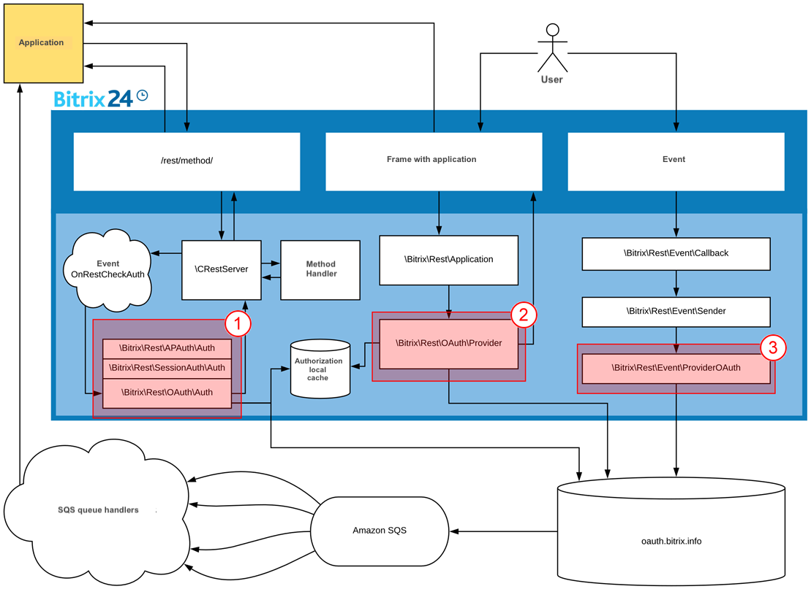

# Application Authorization in Isolated Bitrix24 Box



If you are developing integrations for Bitrix24 using AI tools (Codex, Claude Code, Cursor), connect to the [MCP server](../../../ai-tools/mcp.md) so that the assistant can utilize the official REST documentation.



Company security policies can restrict access to internal and external network resources. For this reason, REST applications for Bitrix24 cannot always connect to an on-premise Bitrix24 or external cloud services. An alternative authorization flow allows you to develop applications using the standard Bitrix24 REST API in an isolated infrastructure.



The solution described below excludes the `oauth.bitrix.info` server from the authorization process. Use it only as a last resort: you are responsible for application security, secret storage, and authorization management.



The solution is suitable for the on-premise version of Bitrix24 if:

- the administrator has access to Bitrix24 files on the server
- a custom module can be created in the `local/modules/` folder
- the application must work only for predefined `client_id` values
- secrets and tokens are stored in protected storage, not in system product files

## Accessing External Resources

During the operation of a REST application, calls from Bitrix24 to external resources are performed by three components:

1. Authorization validator
2. Event provider
3. Authorization provider



The example below shows how to replace these calls with local handlers for one specific application that needs to bypass the main chain.

## Authorization Validator

Create an authorization validator. It checks the request by the `secret_word` parameter and authorizes the user during the current request.

```php
<?php
namespace Demo\AuthProvider;

class AuthSimple
{
    const AUTH_TYPE = 'demo_simple';

    const AUTH_PARAM_NAME = 'secret_word';
    const AUTH_PARAM_VALUE = 'change_this_secret';

    public static function onRestCheckAuth(array $query, $scope, &$res)
    {
        if(array_key_exists(static::AUTH_PARAM_NAME, $query))
        {
            if($query[static::AUTH_PARAM_NAME] === static::AUTH_PARAM_VALUE)
            {
                $error = false;
                $res = array(
                    'user_id' => 1,
                    'scope' => implode(',', \CRestUtil::getScopeList()),
                    'parameters_clear' => array(static::AUTH_PARAM_NAME),
                    'auth_type' => static::AUTH_TYPE,
                );

                if(!\CRestUtil::makeAuth($res))
                {
                    $res = array(
                        'error' => 'authorization_error',
                        'error_description' => 'Unable to authorize user'
                    );
                    $error = true;
                }

                return !$error;
            }

            $res = array(
                'error' => 'INVALID_CREDENTIALS',
                'error_description' => 'Invalid request credentials'
            );

            return false;
        }

        return null;
    }
}
```

The validator receives all application request data. If the request does not contain the `secret_word` parameter, it returns `return null` so that another validator can check the request. If the parameter is present, the handler checks its value.

If the value does not match the stored value, the validator returns the `INVALID_CREDENTIALS` error. If the value is correct, it passes the user `ID`, the list of available scopes, the parameters to remove from the request, and the authorization type ID. The authorization type is required by methods that restrict access by authorization method.

The `AUTH_PARAM_VALUE` value in the example is shown for demonstration. In a production module, store the secret in protected storage and do not commit it to the repository.

After that, the handler calls the REST module method that authorizes the user during the current request. If authorization succeeds, `true` is returned.

Register the validator during module installation:

```php
\Bitrix\Main\EventManager::getInstance()->registerEventHandler(
    'rest',
    'onRestCheckAuth',
    'demo.authprovider',
    '\\Demo\\AuthProvider\\AuthSimple',
    'onRestCheckAuth',
    80
);
```

## Event Provider

Create an event provider class. It extends the standard `Bitrix\Rest\Event\ProviderOAuth` provider and implements the `Bitrix\Rest\Event\ProviderInterface` interface. The example overrides the PHP class method `send`: instead of calling an external event queue, it performs a direct HTTP request to the application handler through `$http->post(...)`.

```php
<?php
namespace Demo\AuthProvider;

use Bitrix\Rest\Event\ProviderInterface;
use Bitrix\Rest\Event\ProviderOAuth;
use Bitrix\Rest\Event\Sender;

class EventProvider extends ProviderOAuth implements ProviderInterface
{
    public static function onEventManagerInitialize()
    {
        Sender::setProvider(static::instance());
    }

    public function send(array $queryData)
    {
        $http = new \Bitrix\Main\Web\HttpClient();
        foreach($queryData as $key => $item)
        {
            if($this->checkItem($item))
            {
                if($item['additional']['sendAuth'])
                {
                    $item['query']['QUERY_DATA']['auth'] = AuthProvider::instance()->get(
                        $item['client_id'],
                        '',
                        $item['auth'],
                        $item['auth'][AuthFull::PARAM_LOCAL_USER]
                    );
                }

                $http->post($item['query']['QUERY_URL'], $item['query']['QUERY_DATA']);
                unset($queryData[$key]);
            }
        }

        if(count($queryData) > 0)
        {
            parent::send(array_values($queryData));
        }
    }

    protected function checkItem(array $item)
    {
        return AuthProvider::instance()->checkClient($item['client_id']);
    }
}
```

The provider checks each element in the event array. If the event belongs to an allowed application, the provider adds authorization data and sends a POST request to the application handler. If the event belongs to another application, the request is passed to the standard provider.

## Authorization Provider

Create an authorization provider class. It extends the standard `Bitrix\Rest\OAuth\Provider` provider and implements the `Bitrix\Rest\AuthProviderInterface` interface.

```php
<?php
namespace Demo\AuthProvider;
use Bitrix\Main\Context;
use Bitrix\Main\NotImplementedException;
use Bitrix\Main\ObjectNotFoundException;
use Bitrix\Main\Security\Random;
use Bitrix\Rest\Application;
use Bitrix\Rest\AppTable;
use Bitrix\Rest\AuthProviderInterface;
use Bitrix\Rest\AuthStorageInterface;
use Bitrix\Rest\OAuth\Provider;
use Bitrix\Rest\RestException;

class AuthProvider extends Provider implements AuthProviderInterface
{
    const TOKEN_TTL = 3600;
    const TOKEN_PREFIX = 'demo.';
    protected $applicationList = array();
    /**
     * @var AuthProvider
     */
    protected static $instance = null;
    /**
     * @var AuthStorageInterface
     */
    protected $storage;
    /**
     * @return AuthProvider
     */
    public static function instance()
    {
        if(static::$instance === null)
        {
            static::$instance = new static();
        }
        return static::$instance;
    }
    public static function onApplicationManagerInitialize()
    {
        Application::setAuthProvider(static::instance());
    }
    public function get($clientId, $scope, $additionalParams, $userId)
    {
        if(!$this->checkClient($clientId))
        {
            return parent::get($clientId, $scope, $additionalParams, $userId);
        }
        if($userId > 0)
        {
            $applicationData = AppTable::getByClientId($clientId);
            if($applicationData)
            {
                $authResult = array(
                    'access_token' => $this->generateToken(),
                    'user_id' => $userId,
                    'client_id' => $clientId,
                    'expires' => time() + static::TOKEN_TTL,
                    'expires_in' => static::TOKEN_TTL,
                    'scope' => $applicationData['SCOPE'],
                    'domain' => Context::getCurrent()->getServer()->getHttpHost(),
                    'status' => AppTable::STATUS_LOCAL,
                    'client_endpoint' => \CRestUtil::getEndpoint(),
                    'member_id' => \CRestUtil::getMemberId(),
                );
                $this->store($authResult);
                return $authResult;
            }
            else
            {
                $authResult = array('error' => RestException::ERROR_OAUTH, 'Application not installed');
            }
            return $authResult;
        }
        return false;
    }
    public function authorizeClient($clientId, $userId, $state = '')
    {
        if(!$this->checkClient($clientId))
        {
            return parent::authorizeClient($clientId, $userId, $state);
        }
        throw new NotImplementedException('Full OAuth authorization is not implemented in this demo');
    }
    public function checkClient($clientId)
    {
        return in_array($clientId, $this->applicationList);
    }
    protected function store(array $authResult)
    {
        $this->getStorage()->store($authResult);
    }
    public function checkToken($token)
    {
        return substr($token, 0, strlen(static::TOKEN_PREFIX)) === static::TOKEN_PREFIX;
    }
    protected function generateToken()
    {
        return static::TOKEN_PREFIX.Random::getString(32);
    }
    /**
     * @return AuthStorageInterface
     * @throws ObjectNotFoundException
     */
    public function getStorage()
    {
        if($this->storage === null)
        {
            throw new ObjectNotFoundException('No token storage set. Use '.__CLASS__.'::instance()->setStorage().');
        }
        return $this->storage;
    }
    /**
     * @param AuthStorageInterface $storage
     * @return AuthProvider
     */
    public function setStorage(AuthStorageInterface $storage)
    {
        $this->storage = $storage;
        return $this;
    }
    /**
     * @param string $clientId
     * @return AuthProvider
     */
    public function addApplication($clientId)
    {
        $this->applicationList[] = $clientId;
        return $this;
    }
}
```

The main PHP class method is `get`. It issues authorization data to the application. The method receives `client_id`, checks whether the application is in the list of allowed applications, retrieves the application data, and forms a structure similar to the response from the standard Bitrix24 OAuth server. The authorization array contains:

- `access_token` — generated token
- `user_id` — user for whom authorization is granted
- `client_id` — application. In the provider, you can specify any token lifetime, not only the one hour used by default in standard authorization
- `expires` — token expiration date
- `scope` — required scopes
- `domain` — Bitrix24 address
- `status` — local application status
- `client_endpoint` — REST endpoint address
- `member_id` — Bitrix24 member ID

Then this data is stored in token storage. The formed structure is returned to the application.

To store and restore tokens, add a storage class. It must implement the `Bitrix\Rest\AuthStorageInterface` interface. The PHP class storage methods perform the following actions: `store` stores a new token, `rewrite` updates the parameters of an existing token, and `restore` returns stored data by `access_token`.

```php
<?php
namespace Demo\AuthProvider;

use Bitrix\Main\Application;
use Bitrix\Rest\AuthStorageInterface;

class AuthStorage implements AuthStorageInterface
{
    const CACHE_TTL = 3600;
    const CACHE_PREFIX = 'demo_auth_';

    public function store(array $authResult)
    {
        $cache = $this->getCache();
        $cache->read(static::CACHE_TTL, $this->getCacheId($authResult['access_token']));
        $cache->set($this->getCacheId($authResult['access_token']), $authResult);
    }

    public function rewrite(array $authResult)
    {
        $cache = $this->getCache();
        $cache->clean($this->getCacheId($authResult['access_token']));
        $cache->read(static::CACHE_TTL, $this->getCacheId($authResult['access_token']));
        $cache->set($this->getCacheId($authResult['access_token']), $authResult);
    }

    public function restore($accessToken)
    {
        $cache = $this->getCache();

        if($cache->read(static::CACHE_TTL, $this->getCacheId($accessToken)))
        {
            return $cache->get($this->getCacheId($accessToken));
        }

        return false;
    }

    protected function getCacheId($accessToken)
    {
        return static::CACHE_PREFIX.$accessToken;
    }

    protected function getCache()
    {
        return Application::getInstance()->getManagedCache();
    }
}
```

Before issuing a token, pass the storage to the provider:

```php
AuthProvider::instance()
    ->setStorage(new AuthStorage())
    ->addApplication('local.demo.application');
```



Method for storing data.

```php
protected function store(array $authResult)
{
    $this->getStorage()->store($authResult);
}
```

The token generation method adds a prefix to a random string of 32 characters.

```php
protected function generateToken()
{
    return static::TOKEN_PREFIX.Random::getString(32);
}
```

Method for checking a token. The presence of the prefix is checked.

```php
public function checkToken($token)
{
    return substr(
        $token,
        0,
        strlen(static::TOKEN_PREFIX)
    ) === static::TOKEN_PREFIX;
}
```

The `checkClient` method checks that the application `client_id` is in the list of allowed applications.

```php
public function checkClient($clientId)
{
    return in_array(
        $clientId,
        $this->applicationList
    );
}
```



Register the provider as the current authorization provider:

```php
\Bitrix\Rest\Application::setAuthProvider(
    Demo\AuthProvider\AuthProvider::instance()
);
```

After registration, the provider becomes the current authorization provider for the allowed application.

Create a full token validator.

```php
<?php
namespace Demo\AuthProvider;

use Bitrix\Rest\OAuth\Auth;

class AuthFull extends Auth
{
    protected static function check($accessToken)
    {
        if(!AuthProvider::instance()->checkToken($accessToken))
        {
            return parent::check($accessToken);
        }

        $authResult = AuthProvider::instance()->getStorage()->restore($accessToken);

        if($authResult === false)
        {
            $authResult = array(
                'error' => 'invalid_token',
                'error_description' => 'Token expired or invalid'
            );
        }

        return $authResult;
    }

}
```

In the validator, extend the standard authorization validator and override the PHP class method `check`. The method checks `accessToken`: if the token was created by your provider, the application data is restored from storage. Then register the event handler during module installation:

```php
\Bitrix\Main\EventManager::getInstance()
    ->registerEventHandler(
        "rest",
        "onRestCheckAuth",
        "demo.authprovider",
        "\\Demo\\AuthProvider\\AuthFull",
        "onRestCheckAuth",
        90
    );
```

The last parameter is the sorting order. The value `90` allows your handler to run before the standard handler.

After registering the full validator, make a request with this authorization token and call the [`app.info`](../../../api-reference/common/system/app-info.md) method. Bitrix24 will return the application data. The event handler will also receive the authorization structure added by `EventProvider`.

```text
Array
(
    [install] => 0
    [DOMAIN] => example.bitrix24.com
    [PROTOCOL] => 1
    [LANG] => en
    [APP_SID] => [redacted]
    [AUTH_ID] => demo.[redacted]
    [AUTH_EXPIRES] => 3600
    [REFRESH_ID] =>
    [member_id] => [redacted]
    [status] => L
    [PLACEMENT] => DEFAULT
)
```



The event provider code runs directly in the event handler. The example contains a POST request to an external server. If the external server responds slowly, event processing in Bitrix24 slows down. During mass operations, such as importing data into CRM, this code can noticeably increase processing time.



You can reduce the risk of slowdown in two ways:

- Build a queue. Instead of sending a POST request, store the data in a table and process it with a separate agent or background process
- Use the [offline events](../../../api-reference/events/offline-events.md) mechanism

## Where to Store the Code

Place the code in a custom module, not in system product files. This prevents the changes from being lost during Bitrix24 updates. The example below shows a file layout for the `demo.authprovider` module in the `local/modules/demo.authprovider/` folder:

```text
local/
`-- modules/
    `-- demo.authprovider/
        |-- include.php
        |-- install/
        |   `-- index.php
        `-- lib/
            |-- authprovider.php
            |-- authstorage.php
            |-- authsimple.php
            |-- authfull.php
            `-- eventprovider.php
```

File responsibilities:

#|
|| **File** | **Stores** ||
|| `local/modules/demo.authprovider/include.php` | Connects the module and configures the provider: `AuthProvider::instance()->setStorage(new AuthStorage())->addApplication('local.demo.application')` ||
|| `local/modules/demo.authprovider/lib/authprovider.php` | The `Demo\AuthProvider\AuthProvider` class that implements `Bitrix\Rest\AuthProviderInterface` and issues authorization data to the application ||
|| `local/modules/demo.authprovider/lib/authstorage.php` | The `Demo\AuthProvider\AuthStorage` class that implements `Bitrix\Rest\AuthStorageInterface` and stores tokens ||
|| `local/modules/demo.authprovider/lib/authsimple.php` | The `Demo\AuthProvider\AuthSimple` class for checking a request by the `secret_word` parameter ||
|| `local/modules/demo.authprovider/lib/authfull.php` | The `Demo\AuthProvider\AuthFull` class that extends `Bitrix\Rest\OAuth\Auth` and restores application data by token ||
|| `local/modules/demo.authprovider/lib/eventprovider.php` | The `Demo\AuthProvider\EventProvider` class that extends `Bitrix\Rest\Event\ProviderOAuth` and sends events without the external OAuth queue ||
|#

In `include.php`, include the REST module and configure the provider:

```php
<?php
use Bitrix\Main\Loader;
use Demo\AuthProvider\AuthProvider;
use Demo\AuthProvider\AuthStorage;

if(Loader::includeModule('rest'))
{
    AuthProvider::instance()
        ->setStorage(new AuthStorage())
        ->addApplication('local.demo.application');
}
```

Replace `local.demo.application` with the `client_id` of the application that is allowed to bypass the standard authorization chain.

Register handlers during module installation in `local/modules/demo.authprovider/install/index.php`. Add the calls to the module installation method after `RegisterModule('demo.authprovider')`:

```php
\Bitrix\Main\EventManager::getInstance()->registerEventHandler(
    'rest',
    'onRestCheckAuth',
    'demo.authprovider',
    '\\Demo\\AuthProvider\\AuthSimple',
    'onRestCheckAuth',
    80
);

\Bitrix\Main\EventManager::getInstance()->registerEventHandler(
    'rest',
    'onRestCheckAuth',
    'demo.authprovider',
    '\\Demo\\AuthProvider\\AuthFull',
    'onRestCheckAuth',
    90
);

\Bitrix\Main\EventManager::getInstance()->registerEventHandler(
    'rest',
    'onApplicationManagerInitialize',
    'demo.authprovider',
    '\\Demo\\AuthProvider\\AuthProvider',
    'onApplicationManagerInitialize'
);

\Bitrix\Main\EventManager::getInstance()->registerEventHandler(
    'rest',
    'onEventManagerInitialize',
    'demo.authprovider',
    '\\Demo\\AuthProvider\\EventProvider',
    'onEventManagerInitialize'
);
```

Connect the code in this order:

1. Create the `demo.authprovider` module in the `local/modules/demo.authprovider/` folder
2. Place the classes in files in the `lib/` folder
3. Configure the provider and the list of allowed `client_id` values in `include.php`
4. Register the `AuthSimple::onRestCheckAuth`, `AuthFull::onRestCheckAuth`, `onApplicationManagerInitialize`, and `onEventManagerInitialize` handlers in `install/index.php`
5. Install the module in the Bitrix24 administrative section
6. Make a request with the authorization token and check the result using the [`app.info`](../../../api-reference/common/system/app-info.md) method

If the code is not packaged as a module, it must be included manually before calling REST. For a production on-premise installation, package the code as a module: it provides class autoloading from `lib/` and preserves handler registration after updates.
