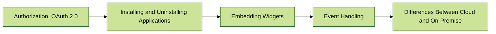

# Key Provisions

The Bitrix24 API reference contains descriptions of all methods and events of the REST API, as well as a number of additional topics important for a deep understanding and effective use of the API in development.

## Reading Sequence of Materials

Key sections of the API that provide an overview of the most important capabilities:

To facilitate the process of studying and using the Bitrix24 REST API, the following reading sequence of materials is suggested:

1. [{#T}](how-to-call-rest-api/authorization.md): This section will help you quickly check how the REST API works and familiarize you with the basic principles of making requests.
2. [{#T}](../api-reference/data-types.md): Understanding the data types used in the REST API is critically important for correctly working with methods and events.
3. [{#T}](oauth/index.md): This section describes the authorization mechanisms based on the OAuth 2.0 standard, obtaining and renewing tokens in applications.
4. [{#T}](app-installation/index.md) and [{#T}](app-uninstallation.md): This section discusses the processes of installing and uninstalling applications in Bitrix24 accounts, which is especially important for developers of mass-market applications.
5. [{#T}](../api-reference/scopes/permissions.md): It explains the specifics of application and webhook access to various REST API methods, allowing you to configure the necessary level of access.
6. [{#T}](../api-reference/widgets/index.md): This section describes ways to integrate custom widgets into the Bitrix24 interface to extend its functionality.
7. [{#T}](../api-reference/events/index.md): This section is dedicated to the REST API event mechanism, which allows tracking changes in data and responding to them with special server handlers.
8. [{#T}](interactivity/index.md): It discusses ways to create interactive applications that utilize the REST API capabilities for interaction between back-end applications and their front-end.
9. [{#T}](performance/limits.md): Important aspects related to application performance and limitations imposed on the use of the REST API.
10. [{#T}](../sdk/bx24-js-sdk/index.md): A section dedicated to the JavaScript SDK, which simplifies working with the REST API on the client side.
11. [{#T}](../sdk/crest-php-sdk/index.md): An overview of the PHP SDK for working with the REST API, providing convenient tools for server-side development.
12. [{#T}](cloud-and-on-premise/index.md): It clarifies the key differences between cloud and on-premise versions of the platform in terms of using the REST API.
13. [{#T}](../api-reference/common/index.md): A description of common methods available in the REST API that can be used in various applications.

{.large-list}

## Bitrix24 Tool

Bitrix24 is a comprehensive product that combines many different tools integrated with each other. This integration allows developers to offer users complete business scenarios using multiple tools.

The API reference contains descriptions of available methods, events, and widgets of the corresponding Bitrix24 tools.

1. [{#T}](../api-reference/common/index.md)
2. [{#T}](../api-reference/biconnector/index.md)
3. [{#T}](../api-reference/crm/index.md)
4. [{#T}](../api-reference/ai/index.md)
5. [News Feed](../api-reference/log/index.md)
6. [{#T}](../api-reference/sale/index.md)
7. [Users](../api-reference/user/index.md)
8. [Workflows](../api-reference/bizproc/index.md)
9. [Tasks](../api-reference/tasks/index.md)
10. [Document Generator](../api-reference/document-generator/index.md)
11. [{#T}](../api-reference/calendar/index.md)
12. [Payment Systems](../api-reference/pay-system/index.md)
13. [{#T}](../api-reference/departments/index.md)
14. [{#T}](../api-reference/user-consent/index.md)
15. [Workgroups and Projects](../api-reference/sonet-group/sonet-group-create.md)
16. [Open Channels](../api-reference/imopenlines/index.md)
17. [Online Booking](../api-reference/booking/index.md)
18. [Chatbots](../api-reference/chat-bots/index.md)
19. [Chats](../api-reference/chats/index.md)
20. [Sites and Stores](../api-reference/landing/index.md)
21. [Message Providers, SMS Providers](../api-reference/messageservice/index.md)
22. [Universal Lists](../api-reference/lists/index.md)
23. [Time Tracking](../api-reference/timeman/index.md)
24. [Data Storage](../api-reference/entity/index.md)
25. [Product Catalog](../api-reference/catalog/index.md)
26. [Telephony](../api-reference/telephony/index.md)
27. [Drive](../api-reference/disk/index.md)
28. [Mail Services](../api-reference/mailservice/index.md)