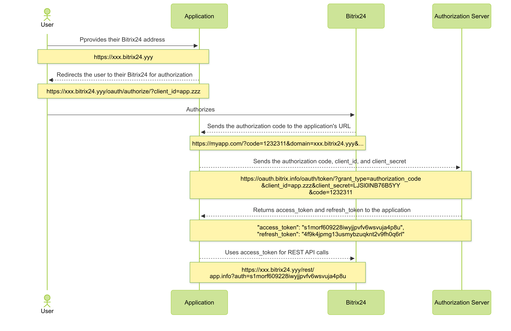

# Complete OAuth 2.0 Authorization Protocol



If you are developing integrations for Bitrix24 using AI tools (Codex, Claude Code, Cursor), connect to the [MCP server](../../ai-tools/mcp.md) so that the assistant can utilize the official REST documentation.



[OAuth](https://oauth.net/) is an open authorization protocol that grants a third party limited access to a user's protected resources without sharing the login and password.

The full protocol is intended for an application that operates outside the Bitrix24 interface and retains tokens on its own side. The user authorizes in their Bitrix24, and the application receives a pair of tokens from the authorization server to work with the REST API.

Obtaining the first pair of tokens is described below. To learn how to renew tokens, see the article [OAuth 2.0 Token Automatic Renewal](auto-renewal.md); to handle authorization server errors, see the article [Authorization Server Error Codes](error-codes.md).

The OAuth protocol is used for [local](../../local-integrations/local-apps.md) and [mass-market](../../market/index.md) applications. [Local webhooks](../../local-integrations/local-webhooks.md) do not use it: a webhook is authorized by the code embedded in the request URL.

## When You Need the Full Protocol

Check that all of the following statements are true:

- you have your own web service — an external application or separate software
- the user is already authorized in your service
- the user needs to authorize in their Bitrix24 so that your service receives tokens for working with the REST API of that Bitrix24
- the user does not work with your service inside the Bitrix24 interface — all scenarios remain on the service side, and the REST API is needed only for data exchange

If at least one statement is false, choose another way to obtain tokens.

#|
|| **Method** | **When It Fits** ||
|| Complete OAuth 2.0 protocol | The application operates outside the Bitrix24 interface and walks the user through authorization itself ||
|| [Simplified Version](simple-way.md) | The application opens in a frame inside the Bitrix24 interface and receives ready-made tokens every time it opens ||
|| [Installation Callback](../app-installation/local-apps/installation-callback.md) | The application has no interface, and the tokens arrive at a handler right after installation ||
|| [Incoming Webhook](../../local-integrations/local-webhooks.md) | The integration works in a single Bitrix24 and is not distributed to other users ||
|#

## How the Protocol Works

Four parties take part in the authorization:

- **user** — the owner of the data on whose behalf the application works with the REST API
- **application** — your service, which retains the tokens and calls REST API methods
- **the user's Bitrix24** — the data source and the place where the user authorizes
- **authorization server** `https://oauth.bitrix.info/` — the holder of the application's authorization; only it issues and renews tokens



The protocol consists of five steps:

1. The user provides the application with the address of their Bitrix24.
2. The application sends the user to their Bitrix24 and adds its `client_id` to the request.
3. The user authorizes in Bitrix24 and returns to the application address with the authorization code `code`. This is not yet a token for working with the REST API, but a one-time code for obtaining tokens.
4. The application contacts the authorization server directly and passes `code`, `client_id`, and `client_secret`.
5. The authorization server returns the first pair of tokens: `access_token` for REST API calls and `refresh_token` for renewing access.



The lifetime of the authorization code `code` is 30 seconds. Exchange it for tokens immediately after receipt.



## What to Prepare Before Authorization

Register the application and obtain a pair of `client_id` and `client_secret`:

- for a [mass-market application](../app-installation/mass-market-apps/index.md) — in the partner area; the keys are valid for any Bitrix24
- for a [local application](../app-installation/local-apps/index.md) — in Bitrix24 itself; the keys are valid only for that Bitrix24

The application must be installed in the Bitrix24 whose user goes through the authorization. For an application that is not installed, the authorization ends with an error.

The application settings specify the return address `redirect_uri` — the application address to which Bitrix24 returns the user after the authorization. This address is not passed in the authorization request; Bitrix24 takes it from the application settings.

The same settings specify the list of access permissions `scope`. The application receives only the permissions listed in its card. Method calls are performed on behalf of the authorized user and are limited by their permissions in Bitrix24.



The secret key `client_secret` is used only in requests to the authorization server **oauth.bitrix.info**. Bitrix24 can be deployed on-premise, so passing the secret to Bitrix24 itself is unsafe. Do not place `client_secret` in code that runs in the browser either. For the same reason, the authorization server remains the only trusted source of information about the application's payment status.



## Full OAuth Authorization in Bitrix24

The complete scenario runs in two steps: first the user authorizes in their Bitrix24, then the application exchanges the received code for tokens.

### Step 1. User Authorization in Bitrix24

The application requests the Bitrix24 address from the user and redirects them to the authorization URL:

```bash
https://portal.bitrix24.com/oauth/authorize/?
     client_id=app.573ad8a0346747.09223434
     &state=JJHgsdgfkdaslg7lbadsfg
```

URL parameters:



#|
|| **Parameter** | **Description** ||
|| **client_id*** | The application code from the partner area or from the local application form ||
|| **state** | Arbitrary application data. Bitrix24 returns the value unchanged, so you can use `state` to match the response with the original request ||
|#

This link opens the authorization form for the user. If the user is already authorized in their Bitrix24, the form is not shown.

If the authorization cannot be completed, Bitrix24 shows the error to the user on its own page. The application receives neither a redirect nor error parameters, so there is no need to handle a failed authorization on the `redirect_uri` side.

After a successful authorization, Bitrix24 returns the user to the application's `redirect_uri` and adds parameters to the address:

```bash
https://www.applicationhost.com/application/?
     code=avmocpghblyi01m3h42bljvqtyd19sw1
     &state=JJHgsdgfkdaslg7lbadsfg
     &domain=portal.bitrix24.com
     &member_id=a223c6b3710f85df22e9377d6c4f7553
     &scope=crm%2Centity%2Cim%2Ctask
     &server_domain=oauth.bitrix.info
```

Parameters:

#|
|| **Parameter** | **Description** ||
|| **code** | The authorization code. The application exchanges it for tokens in [step 2](#app-authorization) ||
|| **state** | The value passed in the first request ||
|| **domain** | The address of the Bitrix24 where the user completed the authorization ||
|| **member_id** | The unique identifier of Bitrix24 that does not change when the address changes ||
|| **scope** | A comma-separated list of REST API access permissions that Bitrix24 granted to the application. The value arrives URL-encoded, with the comma passed as `%2C` ||
|| **server_domain** | The domain of the authorization server ||
|#



In the partner area, you can register an application without a return address `redirect_uri`. This scenario suits mass-market solutions that have no permanent address. Bitrix24 displays a simplified authorization code directly on the page, and the application must provide the user with a field for entering this code.



### Step 2. Application Authorization {#app-authorization}

Having received the authorization code `code`, the application makes a GET request to the authorization server, hidden from the user:

```bash
https://oauth.bitrix.info/oauth/token/?
    grant_type=authorization_code
    &client_id=app.573ad8a0346747.09223434
    &client_secret=LJSl0lNB76B5YY6u0YVQ3AW0DrVADcRTwVr4y99PXU1BWQybWK
    &code=avmocpghblyi01m3h42bljvqtyd19sw1
```

Parameters:



#|
|| **Parameter** | **Description** ||
|| **grant_type*** | The type of authorization data. To exchange the code for tokens, pass the value `authorization_code` ||
|| **client_id*** | The application code, the same value as in step 1 ||
|| **client_secret*** | The secret key of the application from the partner area or from the local application form ||
|| **code*** | The value of the `code` parameter received in step 1. Lifetime — 30 seconds ||
|#

The authorization server responds with the status `200 OK` and a body in the `application/json` format:

```json
{
    "access_token": "s1morf609228iwyjjpvfv6wsvuja4p8u",
    "client_endpoint": "https://portal.bitrix24.com/rest/",
    "domain": "oauth.bitrix.info",
    "expires_in": 3600,
    "member_id": "a223c6b3710f85df22e9377d6c4f7553",
    "refresh_token": "4f9k4jpmg13usmybzuqknt2v9fh0q6rl",
    "scope": "crm,entity,im,task",
    "server_endpoint": "https://oauth.bitrix.info/rest/",
    "status": "F"
}
```

Response data:

#|
|| **Parameter** | **Description** ||
|| **access_token** | The main authorization token for accessing the REST API. Lifetime — one hour ||
|| **refresh_token** | An additional authorization token for renewing the retained authorization. Lifetime — 180 days ||
|| **expires_in** | The lifetime of `access_token` in seconds ||
|| **client_endpoint** | The address of the Bitrix24 REST interface. All method calls start with it ||
|| **server_endpoint** | The address of the REST interface of the authorization server ||
|| **domain** | The domain of the authorization server. In the return parameters of step 1, the `domain` field contains the Bitrix24 address, not the authorization server ||
|| **member_id** | The unique identifier of Bitrix24 ||
|| **scope** | A comma-separated list of access permissions granted to the application ||
|| **status** | The status of the application in Bitrix24. The values match the `STATUS` field of the [app.info](../../api-reference/common/system/app-info.md) method ||
|#

Retain both tokens on your side. The `refresh_token` is needed to obtain new pairs of tokens without the user, so keep it in storage that is not accessible from the browser.

Method calls go to the address from `client_endpoint`: the method name is appended to it, and `access_token` is passed in the `auth` parameter.

```bash
https://portal.bitrix24.com/rest/crm.deal.list?auth=s1morf609228iwyjjpvfv6wsvuja4p8u
```

At this step, the application may receive an authorization error. For example, if the trial or paid period has expired.

```json
{
    "error": "PAYMENT_REQUIRED",
    "error_description": "Payment required"
}
```

Other authorization server errors are covered in the article [Authorization Server Error Codes](error-codes.md).

## What to Do Next

- call a REST API method with the received `access_token` — [How to Call REST API Methods](../how-to-call-rest-api/index.md)
- obtain a new pair of tokens when `access_token` stops working — [OAuth 2.0 Token Automatic Renewal](auto-renewal.md)