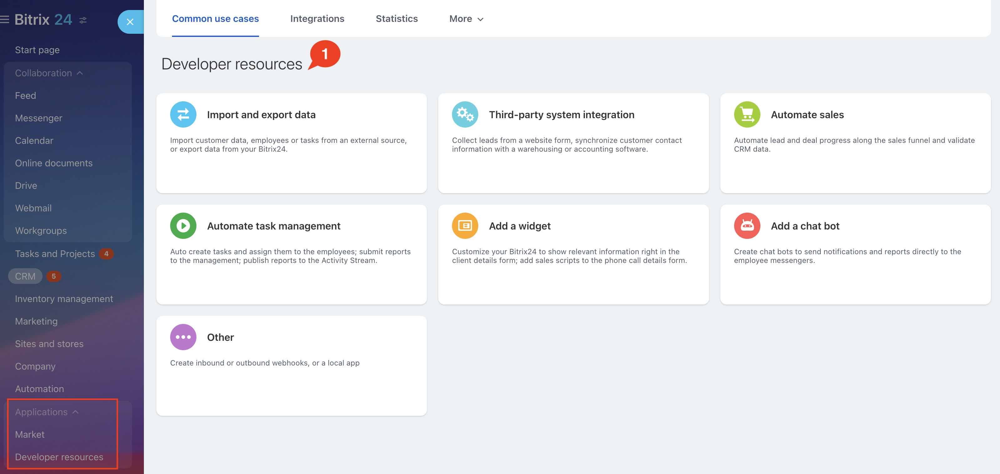
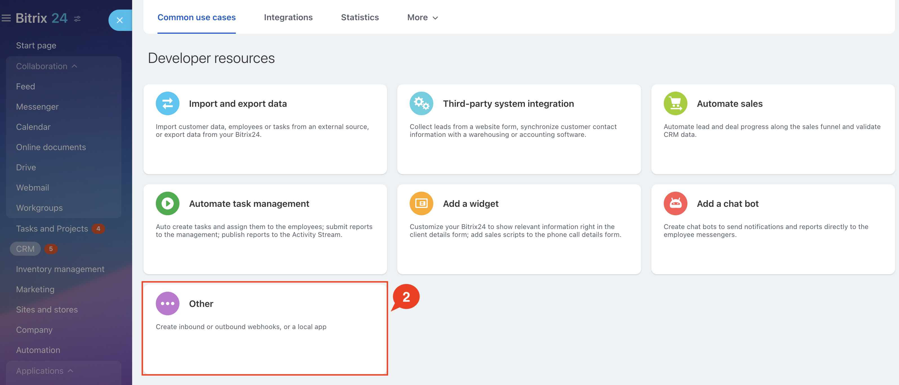
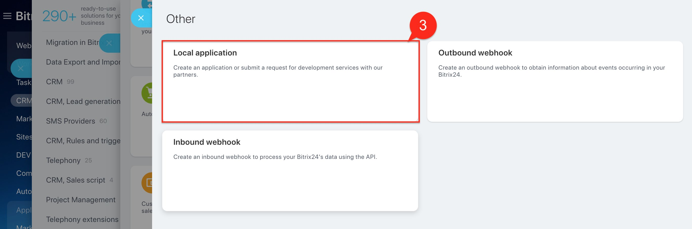
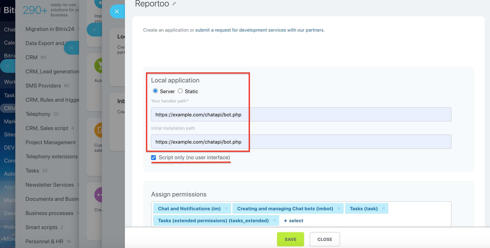

# Example of Creating a Chatbot

As an example, let's create a chatbot that will notify the user about their overdue tasks.

Our chatbot will know and process only one command — "What's burning?", returning a list of overdue tasks. Similarly, its functionality can always be expanded to receive the necessary reports directly in the chat based on any data in _Bitrix24_.

## Chatbot Code

```php
<?php
/**
 * Useful chatbot with reports for bitrix24
 */
$appsConfig     = array();
$configFileName = '/config_' . trim(str_replace('.', '_', $_REQUEST['auth']['domain'])) . '.php';
if (file_exists(__DIR__ . $configFileName)) {
    include_once __DIR__ . $configFileName;
}
// receive event "new message for bot"
if ($_REQUEST['event'] == 'ONIMBOTMESSAGEADD') {
    // check the event - register this application or not
    if (!isset($appsConfig[$_REQUEST['auth']['application_token']])) {
        return false;
    }
    // response time
    $arReport = getAnswer($_REQUEST['data']['PARAMS']['MESSAGE'], $_REQUEST['data']['PARAMS']['FROM_USER_ID']);
    $arReport['attach'][] = array("MESSAGE" => 'Once you handle these tasks, just ask again [send=what\'s burning]What\'s burning?[/send] and I will provide a new summary!');
   
    // send answer message
    $result = restCommand('imbot.message.add', 
        array(
            "DIALOG_ID" => $_REQUEST['data']['PARAMS']['DIALOG_ID'],
            "MESSAGE"   => $arReport['title'] . "\n" . $arReport['report'] . "\n",
            "ATTACH"    => array_merge(
                $arReport['attach']
            ),
        ), 
        $_REQUEST["auth"]);
} // receive event "open private dialog with bot" or "join bot to group chat"
else {
    if ($_REQUEST['event'] == 'ONIMBOTJOINCHAT') {
        // check the event - register this application or not
        if (!isset($appsConfig[$_REQUEST['auth']['application_token']])) {
            return false;
        }
        // send help message on how to use the chatbot. For private chat and for group chat, different instructions need to be sent.
        $result = restCommand('imbot.message.add', array(
            'DIALOG_ID' => $_REQUEST['data']['PARAMS']['DIALOG_ID'],
            'MESSAGE'   => 'Hello! I am ReportBot, reporting everything as it is.',
            "ATTACH"    => array(
                array('MESSAGE' => '[send=what\'s burning]What\'s burning?[/send]'),
            ),
        ), $_REQUEST["auth"]);
    } // receive event "delete chatbot"
    else {
        if ($_REQUEST['event'] == 'ONIMBOTDELETE') {
            // check the event - register this application or not
            if (!isset($appsConfig[$_REQUEST['auth']['application_token']])) {
                return false;
            }
            // unset application variables
            unset($appsConfig[$_REQUEST['auth']['application_token']]);
            // save params
            saveParams($appsConfig);
        } // receive event "Application install"
        else {
            if ($_REQUEST['event'] == 'ONAPPINSTALL') {
                // handler for events
                $handlerBackUrl = ($_SERVER['SERVER_PORT'] == 443 ? 'https' : 'http') . '://' . $_SERVER['SERVER_NAME'] . (in_array($_SERVER['SERVER_PORT'],
                array(80, 443)) ? '' : ':' . $_SERVER['SERVER_PORT']) . $_SERVER['SCRIPT_NAME'];
                // If your application supports different localizations
                // use $_REQUEST['data']['LANGUAGE_ID'] to load correct localization
                // register new bot
                $result = restCommand('imbot.register', array(
                'CODE'                  => 'ReportBot',
                // string identifier of the bot, unique within your application (required)
                'TYPE'                  => 'B',
                // Type of bot, B - bot, responses come immediately, H - human, responses come with a delay of 2 to 10 seconds
                'EVENT_MESSAGE_ADD'     => $handlerBackUrl,
                // Link to the message sending event handler for the bot (required)
                'EVENT_WELCOME_MESSAGE' => $handlerBackUrl,
                // Link to the handler for the event of opening a dialog with the bot or inviting it to a group chat (required)
                'EVENT_BOT_DELETE'      => $handlerBackUrl,
                // Link to the handler for the event of deleting the bot from the client side (required)
                'PROPERTIES'            => array( // Personal data of the chatbot (required)
                    'NAME'              => 'ReportBot',
                    // Name of the bot (required, one of the fields NAME or LAST_NAME)
                    'LAST_NAME'         => '',
                    // Last name of the bot (required, one of the fields NAME or LAST_NAME)
                    'COLOR'             => 'AQUA',
                    // Color of the bot for the mobile application RED, GREEN, MINT, LIGHT_BLUE, DARK_BLUE, PURPLE, AQUA, PINK, LIME, BROWN, AZURE, KHAKI, SAND, MARENGO, GRAY, GRAPHITE
                    'EMAIL'             => 'no@mail.com',
                    // Email for contact
                    'PERSONAL_BIRTHDAY' => '2016-03-23',
                    // Birthday in YYYY-mm-dd format
                    'WORK_POSITION'     => 'Reporting on tasks',
                    // Position held, used as a description of the bot
                    'PERSONAL_WWW'      => '',
                    // Link to the website
                    'PERSONAL_GENDER'   => 'M',
                    // Gender of the bot, acceptable values M - male, F - female, empty if not required
                    'PERSONAL_PHOTO'    => 'iVBORw0KGgoAAAANSUhEUgAAADoAAAA6CAYAAADhu0ooAAAACXBIWXMAAAsTAAALEwEAmpwYAAAKT2lDQ1BQaG90b3Nob3AgSUNDIHByb2ZpbGUAAHjanVNnVFPpFj333vRCS4iAlEtvUhUIIFJCi4AUkSYqIQkQSoghodkVUcERRUUEG8igiAOOjoCMFVEsDIoK2AfkIaKOg6OIisr74Xuja9a89+bN/rXXPues852zzwfACAyWSDNRNYAMqUIeEeCDx8TG4eQuQIEKJHAAEAizZCFz/SMBAPh+PDwrIsAHvgABeNMLCADATZvAMByH/w/qQplcAYCEAcB0kThLCIAUAEB6jkKmAEBGAYCdmCZTAKAEAGDLY2LjAFAtAGAnf+bTAICd+Jl7AQBblCEVAaCRACATZYhEAGg7AKzPVopFAFgwABRmS8Q5ANgtADBJV2ZIALC3AMDOEAuyAAgMADBRiIUpAAR7AGDIIyN4AISZABRG8lc88SuuEOcqAAB4mbI8uSQ5RYFbCC1xB1dXLh4ozkkXKxQ2YQJhmkAuwnmZGTKBNA/g88wAAKCRFRHgg/P9eM4Ors7ONo62Dl8t6r8G/yJiYuP+5c+rcEAAAOF0ftH+LC+zGoA7BoBt/qIl7gRoXgugdfeLZrIPQLUAoOnaV/Nw+H48PEWhkLnZ2eXk5NhKxEJbYcpXff5nwl/AV/1s+X48/Pf14L7iJIEyXYFHBPjgwsz0TKUcz5IJhGLc5o9H/LcL//wd0yLESWK5WCoU41EScY5EmozzMqUiiUKSKcUl0v9k4t8s+wM+3zUAsGo+AXuRLahdYwP2SycQWHTA4vcAAPK7b8HUKAgDgGiD4c93/+8//UegJQCAZkmScQAAXkQkLlTKsz/HCAAARKCBKrBBG/TBGCzABhzBBdzBC/xgNoRCJMTCQhBCCmSAHHJgKayCQiiGzbAdKmAv1EAdNMBRaIaTcA4uwlW4Dj1wD/phCJ7BKLyBCQRByAgTYSHaiAFiilgjjggXmYX4IcFIBBKLJCDJiBRRIkuRNUgxUopUIFVIHfI9cgI5h1xGupE7yAAygvyGvEcxlIGyUT3UDLVDuag3GoRGogvQZHQxmo8WoJvQcrQaPYw2oefQq2gP2o8+Q8cwwOgYBzPEbDAuxsNCsTgsCZNjy7EirAyrxhqwVqwDu4n1Y8+xdwQSgUXACTYEd0IgYR5BSFhMWE7YSKggHCQ0EdoJNwkDhFHCJyKTqEu0JroR+cQYYjIxh1hILCPWEo8TLxB7iEPENyQSiUMyJ7mQAkmxpFTSEtJG0m5SI+ksqZs0SBojk8naZGuyBzmULCAryIXkneTD5DPkG+Qh8lsKnWJAcaT4U+IoUspqShnlEOU05QZlmDJBVaOaUt2ooVQRNY9aQq2htlKvUYeoEzR1mjnNgxZJS6WtopXTGmgXaPdpr+h0uhHdlR5Ol9BX0svpR+iX6AP0dwwNhhWDx4hnKBmbGAcYZxl3GK+YTKYZ04sZx1QwNzHrmOeZD5lvVVgqtip8FZHKCpVKlSaVGyovVKmqpqreqgtV81XLVI+pXlN9rkZVM1PjqQnUlqtVqp1Q61MbU2epO6iHqmeob1Q/pH5Z/YkGWcNMw09DpFGgsV/jvMYgC2MZs3gsIWsNq4Z1gTXEJrHN2Xx2KruY/R27iz2qqaE5QzNKM1ezUvOUZj8H45hx+Jx0TgnnKKeX836K3hTvKeIpG6Y0TLkxZVxrqpaXllirSKtRq0frvTau7aedpr1Fu1n7gQ5Bx0onXCdHZ4/OBZ3nU9lT3acKpxZNPTr1ri6qa6UbobtEd79up+6Ynr5egJ5Mb6feeb3n+hx9L/1U/W36p/VHDFgGswwkBtsMzhg8xTVxbzwdL8fb8VFDXcNAQ6VhlWGX4YSRudE8o9VGjUYPjGnGXOMk423GbcajJgYmISZLTepN7ppSTbmmKaY7TDtMx83MzaLN1pk1mz0x1zLnm+eb15vft2BaeFostqi2uGVJsuRaplnutrxuhVo5WaVYVVpds0atna0l1rutu6cRp7lOk06rntZnw7Dxtsm2qbcZsOXYBtuutm22fWFnYhdnt8Wuw+6TvZN9un2N/T0HDYfZDqsdWh1+c7RyFDpWOt6azpzuP33F9JbpL2dYzxDP2DPjthPLKcRpnVOb00dnF2e5c4PziIuJS4LLLpc+Lpsbxt3IveRKdPVxXeF60vWdm7Obwu2o26/uNu5p7ofcn8w0nymeWTNz0MPIQ+BR5dE/C5+VMGvfrH5PQ0+BZ7XnIy9jL5FXrdewt6V3qvdh7xc+9j5yn+M+4zw33jLeWV/MN8C3yLfLT8Nvnl+F30N/I/9k/3r/0QCngCUBZwOJgUGBWwL7+Hp8Ib+OPzrbZfay2e1BjKC5QRVBj4KtguXBrSFoyOyQrSH355jOkc5pDoVQfujW0Adh5mGLw34MJ4WHhVeGP45wiFga0TGXNXfR3ENz30T6RJZE3ptnMU85ry1KNSo+qi5qPNo3ujS6P8YuZlnM1VidWElsSxw5LiquNm5svt/87fOH4p3iC+N7F5gvyF1weaHOwvSFpxapLhIsOpZATIhOOJTwQRAqqBaMJfITdyWOCnnCHcJnIi/RNtGI2ENcKh5O8kgqTXqS7JG8NXkkxTOlLOW5hCepkLxMDUzdmzqeFpp2IG0yPTq9MYOSkZBxQqohTZO2Z+pn5mZ2y6xlhbL+xW6Lty8elQfJa7OQrAVZLQq2QqboVFoo1yoHsmdlV2a/zYnKOZarnivN7cyzytuQN5zvn//tEsIS4ZK2pYZLVy0dWOa9rGo5sjxxedsK4xUFK4ZWBqw8uIq2Km3VT6vtV5eufr0mek1rgV7ByoLBtQFr6wtVCuWFfevc1+1dT1gvWd+1YfqGnRs+FYmKrhTbF5cVf9go3HjlG4dvyr+Z3JS0qavEuWTPZtJm6ebeLZ5bDpaql+aXDm4N2dq0Dd9WtO319kXbL5fNKNu7g7ZDuaO/PLi8ZafJzs07P1SkVPRU+lQ27tLdtWHX+G7R7ht7vPY07NXbW7z3/T7JvttVAVVN1WbVZftJ+7P3P66Jqun4lvttXa1ObXHtxwPSA/0HIw6217nU1R3SPVRSj9Yr60cOxx++/p3vdy0NNg1VjZzG4iNwRHnk6fcJ3/ceDTradox7rOEH0x92HWcdL2pCmvKaRptTmvtbYlu6T8w+0dbq3nr8R9sfD5w0PFl5SvNUyWna6YLTk2fyz4ydlZ19fi753GDborZ752PO32oPb++6EHTh0kX/i+c7vDvOXPK4dPKy2+UTV7hXmq86X23qdOo8/pPTT8e7nLuarrlca7nuer21e2b36RueN87d9L158Rb/1tWeOT3dvfN6b/fF9/XfFt1+cif9zsu72Xcn7q28T7xf9EDtQdlD3YfVP1v+3Njv3H9qwHeg89HcR/cGhYPP/pH1jw9DBY+Zj8uGDYbrnjg+OTniP3L96fynQ89kzyaeF/6i/suuFxYvfvjV69fO0ZjRoZfyl5O/bXyl/erA6xmv28bCxh6+yXgzMV70VvvtwXfcdx3vo98PT+R8IH8o/2j5sfVT0Kf7kxmTk/8EA5jz/GMzLdsAAAAgY0hSTQAAeiUAAICDAAD5/wAAgOkAAHUwAADqYAAAOpgAABdvkl/FRgAAEdVJREFUeNq8m3uMHVd9xz/nNzP37tvetdfe9dtxnDghIbHJgxClBAnSJKVVGqw0gfJHoU0aiiqBVLWVqoqC1AdSVQlVbXkLSEmQg4oSi4hCWgihhEfiuiHNy3HsrF9rr9f73nvvzPxO/5gzM2fm7iKiBkba3bv3zpxzfuf8Ht/f9/e7JnrkgEUoLgsYQFFEQUWKjxUF3P8K6j4Q/zlVRMQbBwQlm0Td3dkARgUVb8xiDveOUk7gX+p+iXjr0GIUVfdaQBXEeKvWYlQF70Z/DnG3K5p9oIq450w2Q3GvKRbsfisYze4zKEa9MYuptfhfVUHculSzWTV7rd6mKG4N6paOZnNK9l6+3lC9xSHZYpB8Z9wy853JTzo/SSm3Qd0N/kkU96o4wQV/PvG2N9tCKQ/MO//8rKQYuvwEN362W+UB2VxrEMSCUFks3mSKiHrjOcUVyfesEDBffKGAUm5W8aQ4DZF80eJWLsWGFWorUo4n+RLVqWQ5T65hxQa7963bKSOlSkpxoxtQyY/cDamlgognR3ESIsWi84WWwktpBm4n87HQUrXVvS/iaYfnM2wulrvB1nyGpfacZ2+ZpgkhWup0vl/l0ZMdfS5ZvvhcUyTbPeMLL/miPHtQz8q911ROo9Qq3ySMp6o2V1mtPmdy31T7379HEIOK77N876bFenL1U8nt3jkhyed2n/tmoJ6MgIpmzwvO2+YHq8XGSu1EK2N4Xth6KlpssFMUzwKzuRRCVUuX58dzSs59505GRFEFYwxxmkCSQKIQBBCGhKFgCp9bDSfinYYbtFi50XKjxDmtFCDuQJKQBgFIQBBFiDH+rmR+QGquQTMtLaJH5hx8+9NKjKyebLnwxKaA4evX30S8/3189JLLQBMS6+5ys4ovsFKEC/WdhPo2n522BUjafHDHbmbueC8/fsethFFI6uxfvaAoUoY2deu1ArYSV+l2AHn8VF/gPH5pqS+3bxjnzs3bCSXg76/cR3+jCZoUOqb+5PmpOsclWtVJ8eZBQS2QKJ/bdz1rGg2uHRnlQ9t3Z85NSicntfidvzY1K5QK+FAXfrUMtqJepMvdvjuG2J8A+I3RjZCkxenlKlgGQM9fe146DzP58RgRsCl712+ojN/WBLAF+qr6APHCHwVAAW+6Uockv91zQp4DUN/mhB9cmKKdJMVg9+7YDaliSSkduBSqlKAkqSVOU+I086FWtXAguUJatZDEfGD7roqgD04cAwlKr1zGRoqQqeXb2dTqK6kPuaScUijDsJZoRFUxErC0tMD3p6eKhdwwvI6+vj5ULakqSZoS25i00yFZXsJ22libZquxMbbTIWm3SDvLpGmH1FpShdRaCELu2LC5GPvM8hJzi/OVOK1o7TRqYMVzv2EVjZSQzbfHXGCjLmhaCMUQS8CDJ4/xzg1jAPRFEfuGhnny7CnCIOCG4XW8feMmbhsdY1f/IENhSJijIGvpqHK+0+Hw3AUeOnmch08cp5OmYA3r+vrYMtBfrP+BiWMQRgRBUMEE6qJAhrAogIqI52sAEx38mvXjiuZ42LlmrdhvNbjHNmYobDB7+3uK97507BWem5nmDy/ew46+fl7v9eT5c3z4Z4e4Zs1avrDvrcX7+773LQ5dmCaKIi978QNmDlvLEGaLMAkmOnjAFu5X5OcuonACTrnT1IIm/Pfbb+Oq4RGstVhreSMuiyWQ7PSmWsuMPvZvEAqRhAVMzeOxr6nSNY5vzjnAzj/UVYT0oIeoIGIgSfnp7PQbKmQWHkwx5mOTZyDulEDBRQCpO02tYVwvzJTQ08tCjFRhHNRgIJkX1STlg9t28Ztjm99QIYsNd4JeMjAAYtBUUWurAMOzucrJeuHLVJRVpBrkfRPIY2qeQAskccyHd17Mp/Zdx/pGk1/mde3wOl699U6wljRNMKYkRWwlilZBg9SRkSpe8C6T6Aqg98Bckigf3LqDv3vT1fQ4O/plX9v6+nnuHbeBhUTTLA3QkqnwjbNCCLijFi3SDCkQjEiJYEpsnwmvxnLLuvV8/PKrfmVC5teewTU8dM0NEKekmhbJfOGc8tiqHirULHZIgT29ZEKds0GrOZBVZaMIH9l9OWPNntfpXLKMZ6Wf4h732n+vft21eTv3bNsBcYpa6xFhTg7Et8SCWZA6yVbNl0vyS4BElfdvu4hbRsdWF8gTIGcfxOFXYwwG6KRpRfDiHvc6/7uS0NZavrD3OoIwLE5V0Squr6QRjhyzDvEU5utjRqfK1gHzPc0+PrRz96oC+n9PLC3yxPmzfP/8Wf7rwjQT7RaxKolaUiwBhsAYIhE2NRpct3aYG0ZGedeGcXb29UNNWD98NSTgn6/cy73P/AgjAcb6iZCXCZGDHsGEBw9YsxIXWou8sSp/sn0Xf3vF3lVPcTHu8MmXn+fTE8eYnD6XDRQ1IIggClkxf7IWUoWkA50YDKxZu457Nm3mr/ZcyYaevkpszIU2xiAPfwUaTaIw6AI1dRkKQX1YUXJMpUMKrOWHN72Lq9esXVHIP3j6KT736otZmtbby8cvvYIdPX08Pn2WLx09AlFEIB7j5xYUawpxzK3jW7hn01YmO20+8dLzzM/NApb9uy7hi3uvZyBqdAl83+Ef89lXjxBGDXBmsRKSs4AJHzlg8QhfswIMtMCNA4P8x03v6hJyqtXiLU9+h4m5GYgisHD2lt9itLc8iU+88DP+8vnDhI1m12Lidpt7d+7m03uvK95bjmO2Pn6Q861lUGWop5cnbnwHV60ZqcT6lxfm2fP4o0jQRAJTcXzFiZYkmWbMOYLxaEilREqJplw7NLyibb7v0FNMzM1img0QQyMIKkIC3D46Bs52Cyo0Vxur3O6yH5wN9kYRO/oHQAKIIuZaLW5/6omuTb5kcAiJmqhRrwpQZSy0RAGOk3UgQYUKr5uFWcve9aNdQs6223z73CREIaEJQKGTpBxbmK/c9+UTx8HmiXtWC/E51389NZGvHoDFdpuX5ubAGAIMhCGn5mY4MjfbBQhuGFqb2bhQ4f198CBAWOFyKky9R3yoZZ9TG//qi0L6gpClVos4ykGysvNb3+D9O3axrXeAb06e4tDUJPT0uDFNxgflJGcQcOD4UXbNTHP35m1Mtlt8/vjRzGAkyJLwNAEMG3p6KydqreWdoxv5wdlJiKIqP1zDwWGVyKpkoOWdNmWspxsgRBLwnzfezB8dfobD8xeIk05GfaYJX3nxuUw9HU1Ju4UFUisgrtaWp0mp5ejUWf767JlMfcMg89SiRI0GuwdH+OSeKxlqNKqZiTG8aWiNh+LUI6y1Ul4JKQpJWq9/lVeq9AfhijZ63fB6fnLzLVxotTkft5lPYjrW0rIWY8EaaGIIjcECoUBkhFShYxUDpFhaVrPUjOz+ZmDolYCNzR6GPRSmNUJuU08fpGkB3HPCIKdFcuY/NPWktca/iFuIWSWNwlqMCMM9TYZ7fklZjAMLtmaf1lr6o9CBizzjkkqNtYCCWqsbqMfF+OC4penKiKgrvdNV2Yn6/7/wM8ZgvBjs22mc2m46tlaQsj6XXqm85DSlOF0PhOk4/rkUS+4cVhO6vkhZIV779/u0zUr35feeaS9lSbl6z2uVYTCFtopX45Qqs56B35BXFudXZQF8NmC1E1xNkJX+1oWsb5x4p/vszAXH9VLhe+vPS/2oqZWFVDPV+ebk6VUFTa0lWeWnk6YOzGc0iP+TpCkY0/VXbckLJ2maeWufmFMt7PbhUychkMopVx0Nrj5aLUx2gWJFCQLhJ1OTKwoaW+XBkxM8tzCHWktgDOPNXnYPDADwyuIiZ9stMDAcRlw+OMR4Ty+T7RavLC7Q0pTAGAbDkPWNzLtOddrMJXGG1QwExrCnf4gbR9bRDMLMTIBzrRaH5i+AhGVF24N/uSwZYPAbHGr5aPHSwA9nL/D0zAXesrYKBac6Hf7x2BGenc9Qy/pGkw9s28mbhzLw/6OZab504hhTnTaXDgzx+auu5bLBIVILf/bCs7y4MM/aqMHdm7Zy7/YMfX33+DkeOjXBTNzJ7MsY9g6t5aF9b2W8WaZuv3foR6BKIKGXFpV2Kl4FLytBi6DVlNwrBmW/YhNy4OTxrhNd32jwxzt3eyV4VkwKVvpcbcbYR8Yw1uxhtNFktNFkrNlDZExhEh1Vfn/rTtY3ygzm66cm+ObJ4xmwcPyRahUkFPUfgSC4+3c+ZkzZJ1TYgMmKs8Zk6hwEwrm4w6+NrGejF8ADY7hyaA3Pzc/ywuI8aqGVpkzHHZ6ZvcB3p87y2vKys1llPkk43W5xcPI0T89O09KsFhoaQ0OEI4sLfPvcJC8tLhA75HTHxk18/NIrCBwWfmVxgfsOPcWUZiS3YEAMxtm+kBWji0YnYwirRJFU0FEB9p3wLy/M89VTE/zN0NouPmj/+BYeO3eGtqYcnpvl6NIiFlhIEtouBs8lCd84c5LvTE2ykCQspFklbilN+N70OZ6dn8UCF+IOS+6zpgj7x7dUAMujk6d4ud0myG3TqyLnElhVr6FLsj4j311LHTPWYtlXT01w48h63r1hvPL+/vEt/Hhmmk8dO0JLU1qdboCh1jKXxMwlcZdqLyQJC14JMr/u23YR+8e3FP+fbi3z5YnXXMLvcUQqVUYBqbBGknvYrC6pXdXnSuxDmVxe4l+OH+WlFeLq/dt3cefY5qpnN4beIKA/CImMvC7kd+fYZu73aqSxKp+dOMrLy3NubX4LkFeMz1NOj4wPgvfe9THjSk4ZsWWwmul3Fx2JBSMcXVqkpcrbhtfRG5R8zXDU4OL+QabjDs8vzGOA0UaT64dHuHpoGDEwHWd10Fzl+4OQdY0GkQiptUV/yp1jm/nTXXvYMzDoEhzL106f4BMv/S/LasEYrM0Qmao6sGIxRjJOyWHwXIYguPuuj2FMVk/RjHTyvFIhqHqOyRjDMzMztDTl2rUjFWHHmj3sWzNMYAwvLMxzzdph/mL35bxnfAuNIODQ3EyhogNhyM3rRvnt8S3s7OtnKm7T0ZT7t++qCNlR5YGTr/HnL/4Ps50kYxSwWAvWGMQarFiX+dnM3KypEHGhg/WVbrCiabEG2Kn0ASr/dPwIy5rwkZ2XcEn/YPHszr5+PnnZm3nb8DpOtJbZ2tvHUBixo7ePPm9TRqIG+zdt4ddHxzjbbrOlp4eLevu5w1P/M+0Wn5s4yj8cfYnFOKk1YDneWSQj3L2ep7zIlGczYaUTS3xGskxdpTCAiovDonxx4lVOLC9x3/ZdvHvDpoqN5Qs+2W5xsrXMxPISQ0FUaMD23n42NXvpC0K29wZ89KJLC94I4N+nzvCZ40d57NzpQt3V9SUWJW2n7EZKTCsitWxTMNEjB2zJoHgFVtcH6J+quMal8rBLGLCx2cPvbt7OPZu2ccXgml+8VOH5gDwp+Nn8LA+eeo0HTh5nst2qBjI1LrmuteBJN/PnF05NdPCAxW+RkTrHWy2Xq/rUaDcffWn/IO/euIlbR8e4aWT09ZX1p8/x2LkzHJw8xYsreHVrs1Sw0g1alDer+Lzs1c16c03wSNbDIIAVjxPNi77uYetRiap50WZ14NcQ4a1r13HNmhGuHFrDxf0DbO3pY8QR0dNxh4nWEkcWF3h2bpafzk7z1Mx5Oqsk4b4iqmvVKzmDMryI3x7uusLUgIkePWDV1pJcrbXq5eV+8drQnQ0bq/yc4tcbfqmu0FdXS+Yra9XcaRXn6fXaetmMFpRJ1bhzs87i1q9O0KJNqILcpPqdANGydyEHFFlzoBYNgvmDeReX1NBRSWWUr62VFapH3RVSy//36E3RA6jqC1unXaSrSVl8B2S9doaSMpQV+R6plNKLloiaMKb4UbVZRuEVDl4nEZg9lzc8SrUj32rZR78StyQGMK753tQdgXTnkvX/6zHLVJTGnaJaj5Xz6SqXH3obYLs2Iq+7SqlJHjeUN2h2MwZeiw4gajy076dllTPJdN641Cf/6oelntSX7c+Vvviu1vF8tw0YQdUWsxgXK4vyiJpKNVsqX4eRwmYrRSa/6UjU7wvW4kM/XfM9XdEMrNSYCKr98/WviqzEGRep4UpdJLVuGPGRWfVrKWVVTsqG5+KLCNWvtPzfAOI42kZvxsE0AAAAAElFTkSuQmCC',
                    // Bot avatar - base64
                ),
                ), $_REQUEST["auth"]);
                // save params
                $appsConfig[$_REQUEST['auth']['application_token']] = array(
                'BOT_ID'      => $result['result'],
                'LANGUAGE_ID' => $_REQUEST['data']['LANGUAGE_ID'],
                );
                saveParams($appsConfig);
                // write debug log
                // writeToLog($result, 'ReportBot register');
            }
        }
    }
}
/**
 * Save application configuration.
 *
 * @param $params
 *
 * @return bool
 */
function saveParams($params) {
    $config = "<?php\n";
    $config .= "\$appsConfig = " . var_export($params, true) . ";\n";
    $config .= "?>";
    $configFileName = '/config_' . trim(str_replace('.', '_', $_REQUEST['auth']['domain'])) . '.php';
    file_put_contents(__DIR__ . $configFileName, $config);
    return true;
}
/**
 * Send rest query to Bitrix24.
 *
 * @param       $method - Rest method, ex: methods
 * @param array $params - Method params, ex: array()
 * @param array $auth   - Authorize data, ex: array('domain' => 'https://test.bitrix24.com', 'access_token' => '7inpwszbuu8vnwr5jmabqa467rqur7u6')
 *
 * @return mixed
 */
function restCommand($method, array $params = array(), array $auth = array()) {
    $queryUrl  = 'https://' . $auth['domain'] . '/rest/' . $method;
    $queryData = http_build_query(array_merge($params, array('auth' => $auth['access_token'])));
    // writeToLog(array('URL' => $queryUrl, 'PARAMS' => array_merge($params, array("auth" => $auth["access_token"]))), 'ReportBot send data');
    $curl = curl_init();
    curl_setopt_array($curl, array(
        CURLOPT_POST           => 1,
        CURLOPT_HEADER         => 0,
        CURLOPT_RETURNTRANSFER => 1,
        CURLOPT_URL            => $queryUrl,
        CURLOPT_POSTFIELDS     => $queryData,
    ));
    $result = curl_exec($curl);
    curl_close($curl);
    $result = json_decode($result, 1);
    return $result;
}
/**
 * Write data to log file.
 *
 * @param mixed  $data
 * @param string $title
 *
 * @return bool
 */
function writeToLog($data, $title = '') {
    $log = "\n------------------------\n";
    $log .= date("Y.m.d G:i:s") . "\n";
    $log .= (strlen($title) > 0 ? $title : 'DEBUG') . "\n";
    $log .= print_r($data, 1);
    $log .= "\n------------------------\n";
    file_put_contents(__DIR__ . '/imbot.log', $log, FILE_APPEND);
    return true;
}
/**
 * Generate report based on the command
 *
 * @param      string $text string sent by the user
 * @param      int $user identifier of the user who wrote to us
 *
 * @return     array
 */
function getAnswer($command = '', $user) {
    switch (strtolower($command)) {
        case 'what\'s burning':
            $arResult = b24BadTasks($user);
            break;
        default:
            $arResult = array(
                'title' => 'I\'m confused',
                'report'  => 'I can\'t figure out what you want to know. Or maybe I just don\'t know how...',
            );
    }
    return $arResult;
}
function b24BadTasks ($user) {
    $tasks = restCommand('task.item.list', 
        array(
            'ORDER' => array('DEADLINE' => 'desc'),
            'FILTER' => array('RESPONSIBLE_ID' => $user, '<DEADLINE' => date("Y-m-d")),
            'PARAMS' => array(),
            'SELECT' => array()
        ), 
        $_REQUEST["auth"]);
    
    if (count($tasks['result']) > 0) {
        $arTasks = array();
        foreach ($tasks['result'] as $id => $arTask) {
            $arTasks[] = array(
                'LINK' => array(
                'NAME' => $arTask['TITLE'],
                'LINK' => 'https://'.$_REQUEST['auth']['domain'].'/company/personal/user/'.$arTask['RESPONSIBLE_ID'].'/tasks/task/view/'.$arTask['ID'].'/'
                )
            );
            $arTasks[] = array(
                'DELIMITER' => array(
                'SIZE' => 400,
                'COLOR' => '#c6c6c6'
                )
            );
        }
        $arReport = array(
            'title' => 'Yes, some tasks have already passed, for example:',
            'report'  => '',
            'attach' => $arTasks
        );
    }
    else {
        $arReport = array(
            'title' => 'You are doing great!',
            'report'  => 'Nothing to worry about - no overdue tasks',
        );
    }
    return $arReport;
}

```

You can create a new chatbot application either for "personal use" or in the account for publication to all users of _Bitrix24_ through the _Market_.



Using an HTTPS certificate for chatbots is not mandatory, but it is highly recommended to protect client confidential data. The application must be in `UTF-8` encoding.



## Launching the Chatbot on Your Account

You can take the example chatbot code, upload it to your server, and launch the chatbot on your account. Publication through the *Market* is not required. In _Bitrix24_, you can install local applications:

- In the left menu under **Applications** (1), click the **Add Application** button (2):



- Next, select **Other** (3):



- Then select the scenario **Local Application** (4):



- Choose the application type **Server** and configure its parameters:

  - Specify the bot's name (in our example, the bot is called "ReportBot")
  - Enable the option `Uses only API` and grant the application access permissions for:
      - `Web Messenger (im)` — without this permission, it is impossible to send messages to the user
      - `Create and manage Chatbots (imbot)` — without these permissions, the application will not be able to register the chatbot
      - `Tasks (task)` and `Tasks (extended rights) (task_extended)` — without these permissions, the application will not be able to generate a report on tasks to inform the user through the chatbot
  - Since the script is written in such a way that it acts as a handler for all events, the links in the fields `Path to your handler` and `Path for initial installation` will lead to the same URL



After these actions, a message will appear in the general chat stating that a new user — the chatbot named "ReportBot" has joined the account. You can open a chat with it, click on the link "What's burning?" and receive your list of overdue tasks.

If the bot is created for the on-premise version of _Bitrix24_ (the option `Uses only API` is not checked), then use the application type **Static**, specifying in the required field `Archive with your application (zip)` the path to the installer file.



- [Download](https://github.com/bitrix24com/bots) from GitHub the example "EchoBot"

