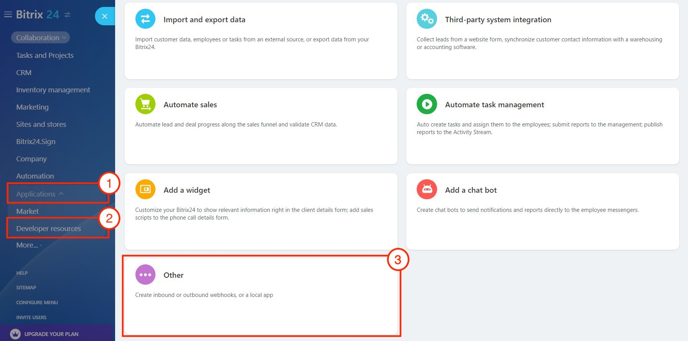
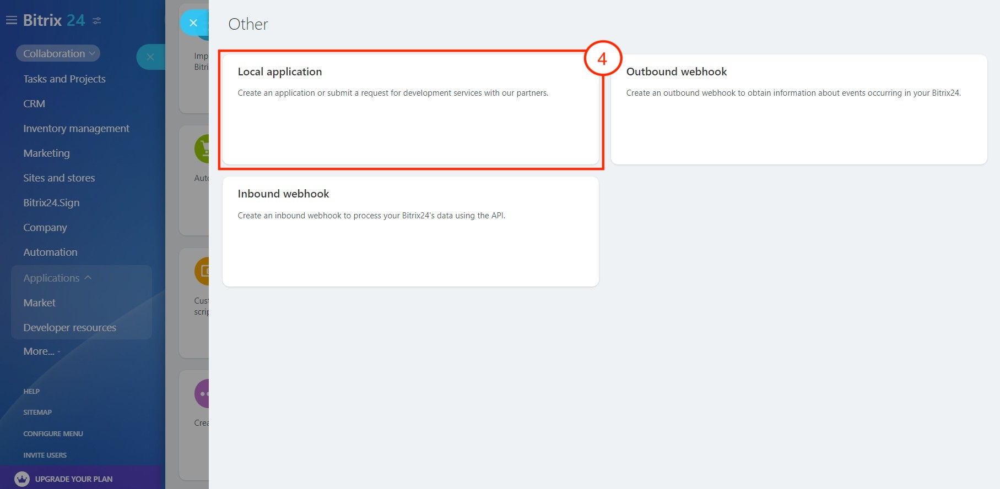
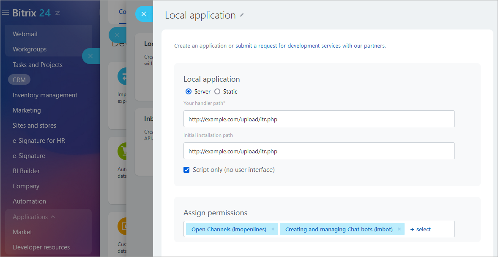
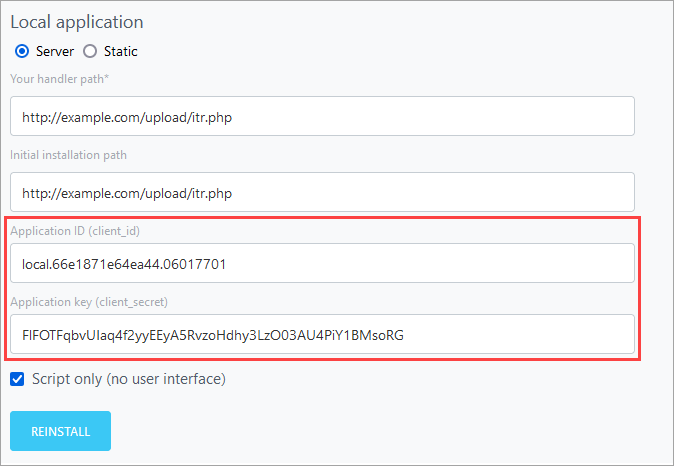
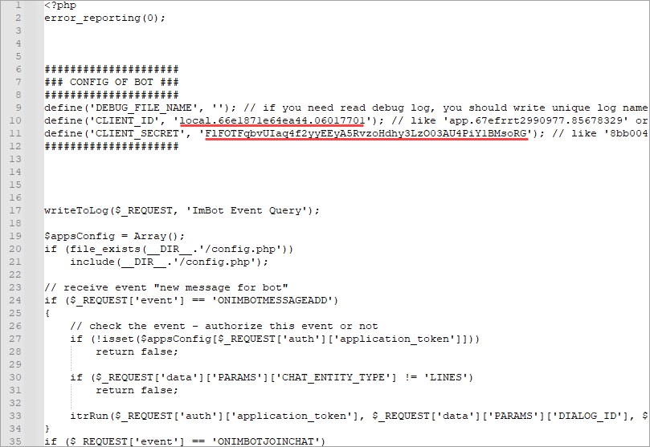
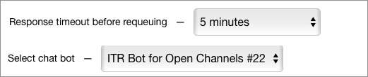
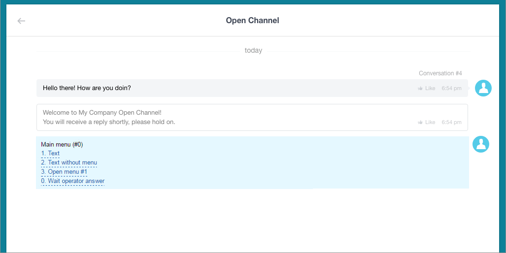

# Example of Creating an Open Channel Chatbot

Design of a chatbot intended for use with *Open Channels* is almost identical to the [standard chatbot](./index.md), but there are two key differences:

1. An *Open Channel* chatbot must have `O` (zero) passed in the `TYPE` parameter when calling [imbot.register](../../api-reference/chat-bots/imbot-register.md) to register a bot.

2. If you want to extend an existing bot to support Open Channels, you have to add a new key `OPENLINE => Y` to enable hybrid mode.

    In hybrid mode, the chatbot must function correctly in group chats, personal chats, and Open Channels chats. To achieve this, you need to check the `CHAT_ENTITY_TYPE` parameter in all incoming events ([ONIMBOTMESSAGEADD](../../api-reference/chat-bots/messages/events/index.md) and [ONIMBOTJOINCHAT](../../api-reference/chat-bots/chats/events/on-imbot-join-chat.md)) — for *Open Channels*, it should be `CHAT_ENTITY_TYPE => LINES`.

Otherwise, the chatbot application is the same as the standard [chatbot](./index.md).

For deeper integration with *Open Channels*, an [`imopenlines`](../../api-reference/scopes/permissions.md) scope access permission is required.

This permission enables the use of the commands:

- [imopenlines.network.join](../../api-reference/imopenlines/openlines/imopenlines-network-join.md) — connects your company's *Open Channel* to the *Bitrix24* account, which enables receiving messages from employees..
- [imopenlines.bot.session.operator](../../api-reference/imopenlines/openlines/chat-bots/imopenlines-bot-session-operator.md) — forwards conversation to the first available operator.
- [imopenlines.bot.session.transfer](../../api-reference/imopenlines/openlines/chat-bots/imopenlines-bot-session-transfer.md) — forwards conversation to a specified operator.
- [imopenlines.bot.session.finish](../../api-reference/imopenlines/openlines/chat-bots/imopenlines-bot-session-finish.md) — finishes current session.



The use of HTTPS certificate is not required for chatbots, but is highly recommended due to possible transmission of client's confidential data. The app itself shall have `UTF-8` encoding.



## Download Example Chatbot for Open Channels

As an example of a chatbot for Open Channels, we have prepared the **ITR Bot**. You can obtain it in the following ways:

- [download](https://github.com/bitrix24com/bots) from the GitHub service (file `itr.php`).
- or found in *Bitrix24 On-premise* here: `\Bitrix\ImBot\Bot\OpenlinesMenuExample`.

This chatbot as the first tier of customer support - initially, all messages will be going to it first, and only then to the employees in the queue after a period of time, that is specified in the *Open Channel* settings. Also, a class will be added to it for constructing a multilevel chat menu.

## Running on Your Account

It means that even now you can [use the code from the chatbot example](#download-example-chatbot-for-open-channels) on your server and launch a chatbot as a local application, without publishing it at *Bitrix24.Market*:

- In the left menu under **Applications** (1), go to the **Developer resources** (2) subsection and select **Other** (3):



- Use the **Local application** script (4):



- Select the application type **Server** and configure its parameters:
    - Change the bot's name.
    - Enable the option `Script only (no user interface)` and grant the application access permissions for:
        - `Creating and managing Chat bots` — without these permissions, the application will not be able to register the chatbot.
        - `Open Channels` — without these permissions, the application will not be able to work with Open Channels.
    - Since the script is written to handle all events, the links in the `Your handler path` and `Initial installation path` fields will point to the same URL.



- After saving the settings, additional fields will appear: `Application ID (client_id)` and `Application key (client_secret)`.



- Copy the data from these fields and paste it into the `itr.php` file:

    

- In the bot settings, click `Reinstall`. Now the bot is ready for operation.

This bot does not publish messages indicating that it has been invited to the account. After installation, it will be available in the Open Channels settings. Select it as responsible and specify the time after which the conversation will be transferred from the chatbot to the queue for employees:





The client can switch to an operator earlier by sending the message `0` or selecting the menu item `0. Wait operator answer`.

With any chatbot, pressing `0` will redirect the user to the operator; no additional processing is required.



Below is a dialogue: first, **ITR Bot** responds, the client clicks on the menu items, and then the queue transitions to the operator (the client selected the menu item **0. Wait operator answer**):



You can configure your own menu in "ITR Bot" in the `itrRun` method:

```php
/**
* Run ITR menu
*
* @param $portalId
* @param $dialogId
* @param $userId
* @param string $message
* @return bool
*/
function itrRun($portalId, $dialogId, $userId, $message = '')
{
    if ($userId <= 0)
        return false;

    $menu0 = new ItrMenu(0);
    $menu0->setText('Main menu (#0)');
    $menu0->addItem(1, 'Text', ItrItem::sendText('Text message (for #USER_NAME#)'));
    $menu0->addItem(2, 'Text without menu', ItrItem::sendText('Text message without menu', true));
    $menu0->addItem(3, 'Open menu #1', ItrItem::openMenu(1));
    $menu0->addItem(0, 'Wait operator answer', ItrItem::sendText('Wait operator answer', true));

    $menu1 = new ItrMenu(1);
    $menu1->setText('Second menu (#1)');
    $menu1->addItem(2, 'Transfer to queue', ItrItem::transferToQueue('Transfer to queue'));
    $menu1->addItem(3, 'Transfer to user', ItrItem::transferToUser(1, false, 'Transfer to user #1'));
    $menu1->addItem(4, 'Transfer to bot', ItrItem::transferToBot('marta', true, 'Transfer to bot Marta', 'Marta not found :('));
    $menu1->addItem(5, 'Finish session', ItrItem::finishSession('Finish session'));
    $menu1->addItem(6, 'Exec function', ItrItem::execFunction(function($context){
        $result = restCommand('imbot.message.add', Array(
            "DIALOG_ID" => $_REQUEST['data']['PARAMS']['DIALOG_ID'],
            "MESSAGE" => 'Function executed (action)',
        ), $_REQUEST["auth"]);
        writeToLog($result, 'Exec function');
    }, 'Function executed (text)'));
    $menu1->addItem(9, 'Back to main menu', ItrItem::openMenu(0));

    $itr = new Itr($portalId, $dialogId, 0, $userId);
    $itr->addMenu($menu0);
    $itr->addMenu($menu1);
    $itr->run(prepareText($message));

    return true;
}
```