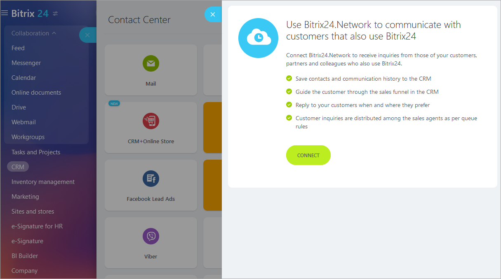
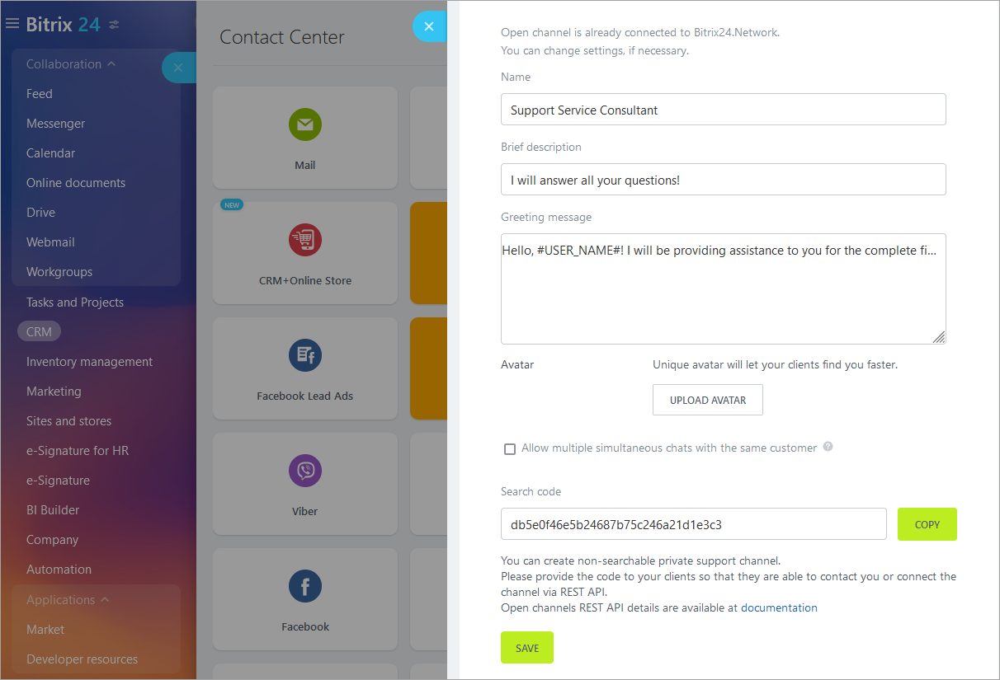
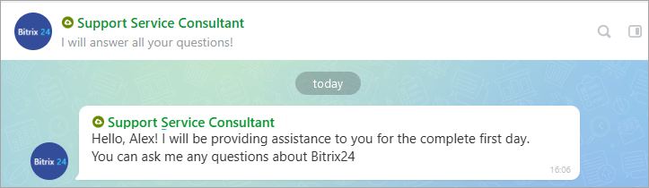
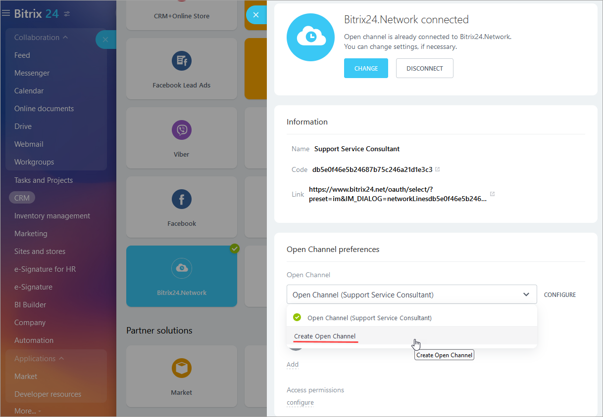

# Example of Creating a Support Channel

With the **Open Channels** module, you can organize technical support for any *Bitrix24* application, including chatbots.

To do this, follow these steps:

- Go to the **Contact Center** section and connect the communication channel `Bitrix24.Network`:



- After that, the connection settings form for `Bitrix24.Network` will be available:



  - Be sure to fill in the `Name` and `Short Description` fields, and set an `Avatar` — this will help clients find you more easily.

  - Once a user enters your Open Channel *Bitrix24.Network*, they will automatically receive a welcome message:
         
  

- Create a new open line for technical support for your product or select an existing one:



Using the method [imopenlines.network.join](../../api-reference/imopenlines/openlines/imopenlines-network-join.md), you can automatically connect your open line to the user account:

```php
$result = restCommand(
    'imopenlines.network.join',
    Array(
        'CODE' => 'a588e1a88baaf301b9d0b0b33b1eefc2b' // code for searching from the connectors page
    ),
    $_REQUEST[
        "auth"
    ]
);
```

After setting up the Open Line, you can send a welcome message to the client using the method [imopenlines.network.message.add](../../api-reference/imopenlines/openlines/imopenlines-network-message-add.md):

```php
Thank you for setting up, we will be happy to help. If you have any questions, feel free to write in this chat. Have a great day! :)
```



`restCommand` is a method for sending data to *Bitrix24*, this method is available in [EchoBot](https://github.com/bitrix24com/bots) and is presented here as an example. You can use your own function or the javascript method [BX24.callMethod](../../how-to-use-examples.md), as well as [bitrix24-php-sdk](https://github.com/mesilov/bitrix24-php-sdk). You can also open such a support channel through the javascript method [BX24.im.openMessenger](../../api-reference/bx24-js-sdk/additional-functions/bx24-im-open-messenger.md).

